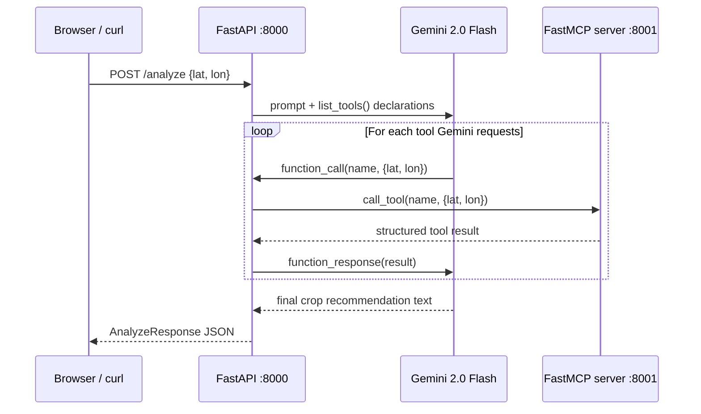

# AgroLLaMA — Agricultural Intelligence MCP Server

> A standards-compliant Model Context Protocol server that exposes six agricultural intelligence tools for Madhya Pradesh. Any MCP-compatible client — Claude Desktop, Cursor, a custom Gemini orchestrator, or a curl script — can connect and query real weather, climate, soil, season, risk, and crop-scoring data for any field location.


---

## What it is

AgroLLaMA is an MCP server first. It publishes six deterministic agricultural tools over the [Model Context Protocol](https://modelcontextprotocol.io) so any MCP-aware client can use them directly — without any bespoke API contract.

On top of that tool server, a FastAPI application hosts a farmer-facing web UI and a `/analyze` endpoint that drives a Gemini 2.0 Flash orchestrator. Gemini calls the MCP tools one by one, collects the evidence bundle, and synthesises a location-aware crop recommendation. The farmer sees none of this machinery — they enter coordinates and get a recommendation.

```
Any MCP client ──────────────────────────────────────┐
                                                      ▼
Browser / curl ──→ FastAPI :8000 ──→ Gemini ──→ FastMCP server :8001/mcp
                                                      │
                              weather · climate · season · risk · soil · crop_score
                                                      │
                              Open-Meteo · mp_districts.geojson · soil_fixed.json · crop_log.csv
```

---

## MCP server capabilities

| Capability | Status |
|---|---|
| Standard MCP transport (streamable-http) | Yes |
| Tool registry with JSON Schema | Yes |
| Model-driven tool invocation | Yes — Gemini function calling |
| Structured tool responses | Yes — typed dicts per tool |
| Tool discovery across MCP clients | Yes — `list_tools()` |
| Multi-client interoperability | Yes — Claude Desktop, Cursor, custom clients |
| MCP resources or prompt templates | Not implemented (out of scope) |

---

## The six MCP tools

| Tool | What it returns | Data source | Complexity |
|---|---|---|---|
| `weather_tool` | Current temp, 7-day forecast rain, humidity, precip probability | Open-Meteo forecast | 1 HTTP call; 1-hour TTL cache |
| `climate_tool` | 2014–2023 monthly temperature and rainfall normals + std dev | Open-Meteo archive | 1 HTTP call; 7-day TTL cache |
| `season_tool` | Current Kharif / Rabi / Zaid season in IST | System clock | O(1) |
| `risk_tool` | SPI-1 drought probability, heatwave score, flood heuristic | Open-Meteo forecast + archive | 2 HTTP calls; scipy gamma fit |
| `get_soil_by_coordinates` | District, dominant soil, characteristics, agricultural suitability | `mp_districts.geojson` + `soil_fixed.json` | R-tree spatial index; point-in-polygon |
| `crop_score` | Top-6 ranked crops with scores across rainfall, temperature, soil, season, risk | All five tools above + `crop_log.csv` | Deterministic weighted scoring |

All tools accept `latitude: float` and `longitude: float` in EPSG:4326 decimal degrees.

---

## System architecture

### Two-process design

```
┌─────────────────────────────────────────────────┐
│  Process 1 — FastAPI (port 8000)                │
│                                                 │
│  app/main.py          HTTP entrypoint + web UI  │
│  app/orchestrator.py  Gemini tool-calling loop  │
│  app/llm/             MCP client + Gemini SDK   │
│  app/schemas/         Pydantic request/response │
│  app/static/          Browser UI assets         │
└──────────────────────────┬──────────────────────┘
                           │ MCP streamable-http :8001/mcp
                           ▼
┌─────────────────────────────────────────────────┐
│  Process 2 — FastMCP server (port 8001)         │
│                                                 │
│  mcp_server/server.py   FastMCP app + 6 tools   │
│  mcp_server/weather_tool.py                     │
│  mcp_server/climate_tool.py                     │
│  mcp_server/season_tool.py                      │
│  mcp_server/risk_tool.py                        │
│  mcp_server/soil_tool.py                        │
│  mcp_server/crop_score_tool.py                  │
│  mcp_server/open_meteo_client.py  shared HTTP   │
└─────────────────────────────────────────────────┘
```

The FastAPI process auto-launches the MCP server as a subprocess on startup (configurable via `MCP_AUTOSTART`). Both processes shut down cleanly on Ctrl+C.

### Request lifecycle

1. Client POSTs `{"latitude": …, "longitude": …}` to `/analyze`.
2. `app/main.py` validates and forwards to `app/orchestrator.run_analysis`.
3. `GeminiClient` opens a short-lived MCP session and calls `list_tools()` to retrieve live declarations.
4. Declarations are converted to Gemini `FunctionDeclaration` objects and sent with the user prompt.
5. Gemini emits function calls one by one (weather → climate → season → risk → soil → crop_score).
6. For each call, `GeminiClient` calls `mcp.call_tool(name, args)` over streamable-http and injects the result back as a `FunctionResponse`.
7. After all tools respond, Gemini synthesises a final crop recommendation.
8. `/analyze` returns `location`, `tool_execution_order`, `tools_output`, and `llm_final_message`.



---

## Repository structure

```
.
├── mcp_server/                    MCP server package (the tool layer)
│   ├── server.py                  FastMCP app + 6 @mcp.tool() registrations
│   ├── weather_tool.py            Open-Meteo forecast aggregation
│   ├── climate_tool.py            2014–2023 climate normals
│   ├── season_tool.py             IST month → Kharif/Rabi/Zaid
│   ├── risk_tool.py               SPI-1 drought, heatwave, flood heuristics
│   ├── soil_tool.py               GeoPandas point-in-polygon soil lookup
│   ├── crop_score_tool.py         Deterministic weighted crop ranking
│   ├── open_meteo_client.py       Shared HTTP client with retries
│   └── __init__.py
│
├── app/                           FastAPI application (client + web layer)
│   ├── main.py                    FastAPI entrypoint, lifespan, MCP subprocess
│   ├── orchestrator.py            Bridge from HTTP request to Gemini tool loop
│   ├── llm/
│   │   └── gemini_client.py       MCP client + Gemini function-calling loop
│   ├── schemas/
│   │   └── models.py              Pydantic request/response contracts
│   ├── tools/
│   │   └── __init__.py            Shim — re-exports soil_tool for startup checks
│   └── static/                    Browser UI (index.html, app.js, styles.css)
│
├── scripts/
│   ├── test_mcp_tools.py          Per-tool MCP smoke test
│   └── test_e2e_analyze.py        End-to-end /analyze integration test
│
├── data/
│   ├── processed/
│   │   ├── mp_districts.geojson   51 MP district polygons (runtime)
│   │   └── soil_fixed.json        52 district soil records (runtime)
│   └── raw/                       Preprocessing inputs (not used at runtime)
│       ├── gadm41_IND_shp/        GADM India administrative shapefiles
│       ├── soil.json              Raw malformed soil source
│       └── *.xlsx / *.csv        Research artifacts
│
├── notebooks/
│   └── soil_data_process.ipynb   Data curation: GeoJSON extraction + soil repair
│
├── crop_log.csv                   21-crop reference table injected into Gemini prompt
├── .env                           GEMINI_API_KEY (not committed)
└── requirements.txt               mcp[cli]>=1.13.0 + full environment freeze
```

---

## Installation

### Prerequisites

- Python 3.10 or newer
- A [Gemini API key](https://aistudio.google.com/app/apikey) in `GEMINI_API_KEY`
- GeoPandas and its compiled dependencies (see note below)

### Setup

```bash
python -m venv .venv
```

Windows PowerShell:

```powershell
.\.venv\Scripts\Activate.ps1
```

macOS / Linux:

```bash
source .venv/bin/activate
```

Install dependencies:

```bash
pip install -r requirements.txt
```

Create `.env` in the project root:

```env
GEMINI_API_KEY=your_gemini_api_key_here
```

### GeoPandas on Windows

If `geopandas` fails to install, use prebuilt wheels or a Conda environment:

```bash
conda install -c conda-forge geopandas
```

---

## Running the system

### One-command start (recommended)

FastAPI auto-launches the MCP server as a subprocess:

```bash
uvicorn app.main:app --reload
```

Open:
- Web UI: `http://127.0.0.1:8000/`
- API docs: `http://127.0.0.1:8000/docs`
- Health: `http://127.0.0.1:8000/health`
- MCP server: `http://127.0.0.1:8001/mcp`

> **Note for `--reload` development:** uvicorn restarts the FastAPI process on every file save, which would spawn a new MCP child each time. Set `MCP_AUTOSTART=false` and run the MCP server in a second terminal instead (see below).

### Two-terminal start (recommended during development with --reload)

Terminal 1 — MCP server:

```bash
python -m mcp_server.server
```

Terminal 2 — FastAPI:

```bash
MCP_AUTOSTART=false uvicorn app.main:app --reload
```

PowerShell:

```powershell
$env:MCP_AUTOSTART="false"; uvicorn app.main:app --reload
```

### Environment variables

| Variable | Default | Description |
|---|---|---|
| `GEMINI_API_KEY` | — | Required. Google Gemini API key. |
| `MCP_AUTOSTART` | `true` | Set to `false` to skip subprocess launch and expect an external MCP server. |
| `MCP_SERVER_URL` | `http://127.0.0.1:8001/mcp` | URL the FastAPI app uses to reach the MCP server. |
| `MCP_PORT` | `8001` | Port the MCP server listens on. |
| `MCP_HOST` | `127.0.0.1` | Host the MCP server binds to. |
| `MCP_PROBE_TIMEOUT` | `30` | Seconds FastAPI waits for the MCP server to become ready on startup. |

---

## Using AgroLLaMA as an MCP server

Any MCP-compatible client can connect directly to the tool server without going through the FastAPI application.

### Claude Desktop

Add to `claude_desktop_config.json`:

```json
{
  "mcpServers": {
    "agrollama": {
      "url": "http://127.0.0.1:8001/mcp",
      "transport": "streamable-http"
    }
  }
}
```

Then ask Claude: *"What is the soil type for latitude 23.26, longitude 77.41?"* — it will call `get_soil_by_coordinates` directly.

### Cursor

In `.cursor/mcp.json`:

```json
{
  "mcpServers": {
    "agrollama": {
      "url": "http://127.0.0.1:8001/mcp"
    }
  }
}
```

### Custom MCP client (Python)

```python
import asyncio
from mcp import ClientSession
from mcp.client.streamable_http import streamablehttp_client

async def main():
    async with streamablehttp_client("http://127.0.0.1:8001/mcp") as (read, write, _):
        async with ClientSession(read, write) as session:
            await session.initialize()

            # List all six tools
            tools = await session.list_tools()
            print([t.name for t in tools.tools])

            # Call the soil tool for Bhopal
            result = await session.call_tool(
                "get_soil_by_coordinates",
                {"latitude": 23.2599, "longitude": 77.4126},
            )
            print(result.structuredContent)

asyncio.run(main())
```

---

## Verification

### Per-tool MCP smoke test

With the MCP server running (either standalone or via FastAPI autostart):

```bash
python scripts/test_mcp_tools.py
```

This script:
1. Calls `list_tools()` and asserts all 6 tools are present.
2. Calls each tool with Bhopal coordinates (23.2599, 77.4126) and asserts the expected response keys.
3. Calls `get_soil_by_coordinates` with Delhi coordinates (28.61, 77.21) and asserts the out-of-region error.

Expected output:

```
=== list_tools() ===
  [PASS] All 6 expected tools present
=== weather_tool ... ===
  [PASS] weather_tool returned expected shape
...
RESULT: all tool checks passed.
```

### End-to-end /analyze test

With both servers running:

```bash
python scripts/test_e2e_analyze.py
```

Asserts:
- `location` is echoed back
- `tool_execution_order` contains 6 entries
- `tools_output` contains all 6 expected keys (`weather`, `climate_normals`, `season`, `risk_analysis`, `get_soil_by_coordinates`, `crop_score`)
- `llm_final_message` is a non-empty crop recommendation

### Manual API call

```bash
curl -X POST http://127.0.0.1:8000/analyze \
  -H "Content-Type: application/json" \
  -d '{"latitude": 23.2599, "longitude": 77.4126}'
```

PowerShell:

```powershell
Invoke-RestMethod -Uri "http://127.0.0.1:8000/analyze" `
  -Method POST `
  -ContentType "application/json" `
  -Body '{"latitude": 23.2599, "longitude": 77.4126}'
```

### Example response

```json
{
  "location": { "latitude": 23.2599, "longitude": 77.4126 },
  "tool_execution_order": [
    "weather_tool", "climate_tool", "season_tool",
    "risk_tool", "get_soil_by_coordinates", "crop_score"
  ],
  "tools_output": {
    "weather": {
      "tool": "weather", "avg_temp_c": 38.1, "total_rainfall_mm": 0.0,
      "rainfall_past_7d_mm": 0.0, "avg_humidity_percent": 18
    },
    "climate_normals": {
      "tool": "climate_normals", "avg_temp_normal_c": 25.2,
      "avg_rainfall_normal_mm": 89.4
    },
    "season": { "tool": "season", "current_month": 5, "current_season": "Zaid" },
    "risk_analysis": {
      "tool": "risk_analysis", "drought_probability": 0.08,
      "flood_probability": 0.05, "heatwave_probability": 0.52,
      "heatwave_severity": "high"
    },
    "get_soil_by_coordinates": {
      "district": "Bhopal", "dominant_soil": "Deep soil",
      "soil_characteristics": "Heavy black cotton soil with high water retention",
      "agricultural_suitability": "Soybean, wheat, cotton"
    },
    "crop_score": {
      "tool": "crop_score", "current_season": "Zaid",
      "ranked_crops": [
        { "crop": "Watermelon", "total_score": 0.71, "plantable_now": true },
        { "crop": "Moong", "total_score": 0.60, "plantable_now": false }
      ]
    }
  },
  "llm_final_message": "Based on the Zaid season conditions in Bhopal…"
}
```

---

## Tool internals

### Drought — SPI-1 (Standardised Precipitation Index)

`risk_tool` fits a gamma distribution on 2019–2023 monthly precipitation totals for the current calendar month, treats dry months as a discrete probability mass, converts the CDF to a z-score via the inverse standard normal, and maps SPI bands to drought probability:

```
SPI < −2.0  →  severe   (70% probability)
SPI < −1.5  →  moderate (55%)
SPI < −1.0  →  mild     (22%)
otherwise   →  normal   ( 8%)
```

Falls back to empirical rank if fewer than two historical values or gamma fit fails.

### Crop scoring — weighted evidence fusion

`crop_score` scores every crop in `crop_log.csv` across five dimensions:

| Dimension | Weight | Signal |
|---|---|---|
| Season alignment + sowing window | 30% | Current ISO week vs. sowing_start/end_week |
| Rainfall match | 20% | Seasonal climate rainfall vs. crop requirement |
| Soil type match | 20% | Keyword-category overlap (black, alluvial, red, clay, sandy…) |
| Temperature match | 15% | Current/normal temperature vs. crop range |
| Risk penalty | 15% | risk_sensitivity string × hazard probabilities × peak-water multiplier |

Returns the top 6 crops with full score breakdown, `plantable_now` flag, sowing window, and days to harvest.

### Soil retrieval — geospatial point-in-polygon

`soil_tool` loads `mp_districts.geojson` once at startup, builds a GeoPandas R-tree spatial index, and for each request:

1. Queries the index for candidate district polygons.
2. Tests `geometry.covers(point)` to include boundary points.
3. Normalises the matched district name (alias table + regex) and looks up the soil record in `soil_fixed.json`.

Returns an `error: "Outside Madhya Pradesh"` if the point is not within any district polygon.

---

## Data provenance

| Asset | Records | Role | Runtime |
|---|---|---|---|
| `data/processed/mp_districts.geojson` | 51 district polygons | Spatial boundary lookup | Yes |
| `data/processed/soil_fixed.json` | 52 district soil records | Soil metadata store | Yes |
| `crop_log.csv` | 21 crops | Crop priors in Gemini prompt + scoring | Yes |
| `data/raw/gadm41_IND_shp/` | GADM India level 0–3 | Source for GeoJSON preprocessing | No |
| `data/raw/soil.json` | Raw malformed source | Repaired by notebook into soil_fixed.json | No |
| `notebooks/soil_data_process.ipynb` | — | Data curation pipeline | No |

---

## Known open items

| Item | Notes |
|---|---|
| Sync FastAPI + sync `requests` in tools | All tool HTTP calls are synchronous. Migrating to `httpx.AsyncClient` + async endpoints would improve concurrent throughput. |
| One MCP session per tool call | `GeminiClient` opens a fresh MCP session for every `call_tool`. A persistent session on a background loop would save ~100 ms per call. |
| `requirements.txt` is a full conda freeze | Not cleanly installable on a fresh machine. Should be replaced with a minimal `pyproject.toml`. |
| No automated test suite | `scripts/` contains smoke tests only. A `pytest` suite with mocked Open-Meteo responses would add regression coverage. |
| `crop_log.csv` column typo | The `Tempreture` column name is referenced as-is in `gemini_client.py` and `crop_score_tool.py`. |
| CORS is fully open | `allow_origins=["*"]` is fine for local prototypes; restrict before public deployment. |
| `min_temps_7d` unused | The heatwave function accepts but discards minimum temperatures. |
| No frontend renderer for `crop_score` | The browser UI falls back to a raw JSON block for the `crop_score` card. |
| `Niwari` district has no soil match | A new district (2018). `soil_fixed.json` predates its creation. |

---

## Docker reference

The repository does not ship a `Dockerfile`, but this pattern matches the current codebase:

```dockerfile
FROM python:3.11-slim

WORKDIR /app

RUN apt-get update && apt-get install -y --no-install-recommends \
    gdal-bin libgdal-dev build-essential \
    && rm -rf /var/lib/apt/lists/*

COPY requirements.txt .
RUN pip install --no-cache-dir mcp[cli]>=1.13.0 fastapi uvicorn geopandas shapely \
    scipy pytz python-dotenv google-generativeai requests httpx

COPY . .

ENV PYTHONUNBUFFERED=1
ENV MCP_AUTOSTART=true
EXPOSE 8000 8001

CMD ["uvicorn", "app.main:app", "--host", "0.0.0.0", "--port", "8000"]
```

For production, run the MCP server and FastAPI in separate containers and set `MCP_SERVER_URL` to the internal service address.

---

## Future work

- Async tool execution — emit multiple MCP `call_tool` requests in parallel when Gemini emits multiple function calls in one turn.
- Persistent MCP session — reuse one `ClientSession` per worker process instead of opening one per tool call.
- Calibrated hazard models — replace heuristic flood thresholds with district-level historical exceedance probabilities.
- Satellite and IoT integration — NDVI, soil moisture sensors, and rainfall station feeds as additional MCP tools.
- Multilingual interface — Hindi and regional dialect support in the Gemini prompt and web UI.
- Offline-first — edge deployment for low-connectivity environments using cached climate normals and local model inference.
- Structured recommendation schema — enforce a typed crop-recommendation output from Gemini rather than free text.
- MCP resources — expose `soil://district/{name}` and `climate://normals/{lat}/{lon}` as cacheable MCP resources.
- CI and data versioning — automated smoke tests, dataset hash checks, and reproducible preprocessing pipelines.
