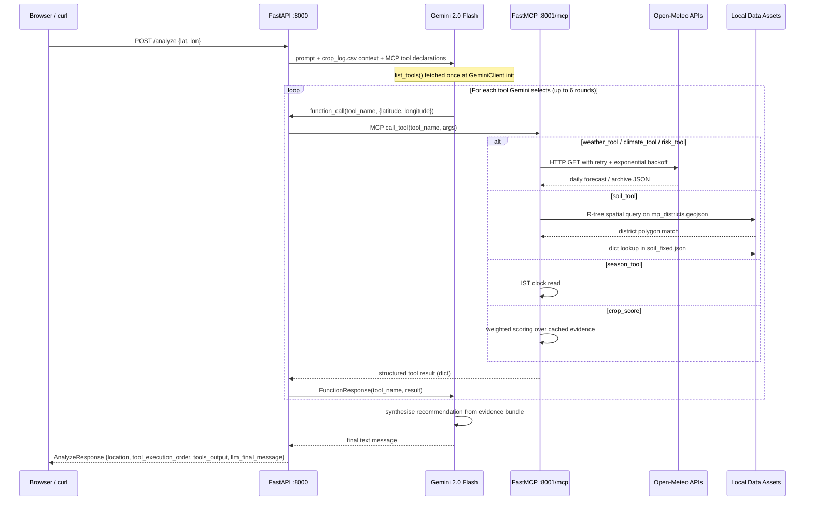
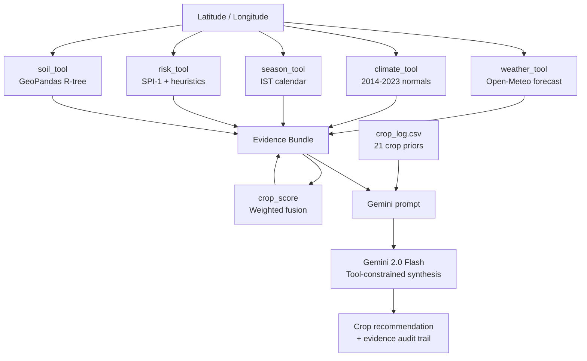
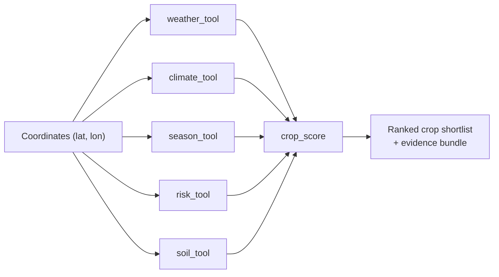
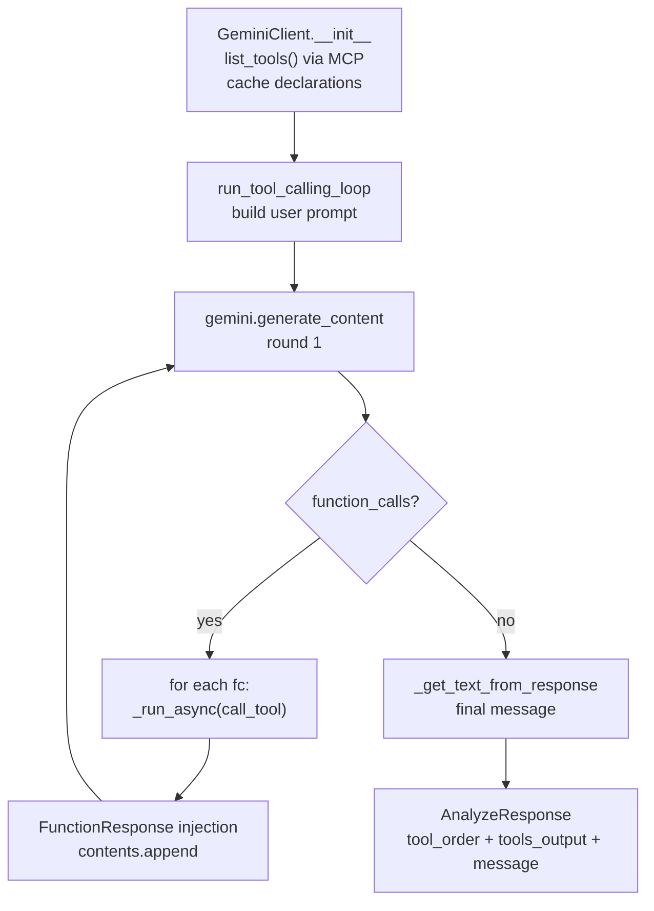
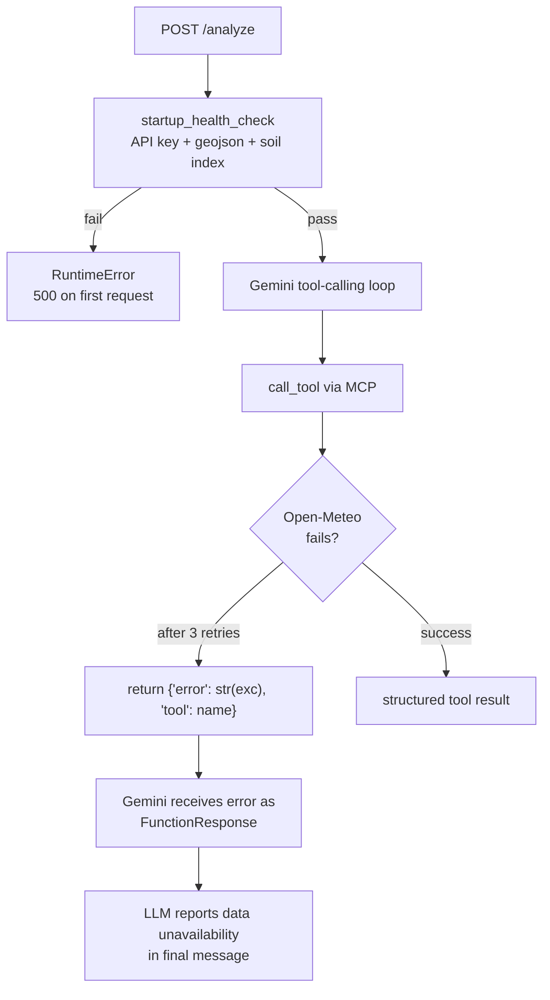

# AgroLLaMA

**A standards-compliant Model Context Protocol server for location-aware agricultural intelligence in Madhya Pradesh.**

[](https://python.org)
[](https://modelcontextprotocol.io)
[](https://github.com/jlowin/fastmcp)
[](https://fastapi.tiangolo.com)
[](https://ai.google.dev)
[](https://geopandas.org)
[](https://scipy.org)
[](https://en.wikipedia.org/wiki/Madhya_Pradesh)
[](https://github.com)
[](LICENSE)

---

> AgroLLaMA is an MCP server that exposes six deterministic agricultural intelligence tools over the Model Context Protocol. Any MCP-compatible client -- Claude Desktop, Cursor, a custom Gemini orchestrator, or a raw Python script -- can connect and receive real weather, climate, soil, seasonal, risk, and crop-scoring data for any field coordinate in Madhya Pradesh. On top of the tool server, a FastAPI application drives a Gemini 2.0 Flash reasoning loop that collects the full evidence bundle and synthesises a location-aware crop recommendation for the farmer.

```
                        MCP streamable-http :8001/mcp
                       /
Claude Desktop --------+
Cursor         --------+----> FastMCP Server ----> weather_tool
Custom client  --------+      (port 8001)      --> climate_tool
                       |                       --> season_tool
Browser / curl --> FastAPI (port 8000)         --> risk_tool  [SPI-1]
                    |                          --> soil_tool  [R-tree]
                    v                          --> crop_score [weighted fusion]
                 Gemini 2.0 Flash
                 (MCP client + planner)
```

---

## Table of Contents

- [Project Vision](#project-vision)
- [System Architecture](#system-architecture)
- [Repository Structure](#repository-structure)
- [Tool Reference and Algorithms](#tool-reference-and-algorithms)
- [AI and ML Architecture](#ai-and-ml-architecture)
- [Research Contributions](#research-contributions)
- [Performance and Scalability](#performance-and-scalability)
- [Security and Reliability](#security-and-reliability)
- [Installation](#installation)
- [Running the System](#running-the-system)
- [Usage Examples](#usage-examples)
- [Verification](#verification)
- [Known Limitations and Open Items](#known-limitations-and-open-items)
- [Future Work](#future-work)

---

## Project Vision

### The problem

Crop advisory in rural India has historically depended on either generalised government bulletins or word-of-mouth agronomic knowledge. Neither is calibrated to a specific field's soil, the current week's weather, the active cropping season, or the live hazard environment. Farmers in Madhya Pradesh -- managing 60+ distinct soil types across 10 agro-climatic zones -- make sowing, input, and water-management decisions with essentially no access to location-specific, evidence-grounded reasoning.

Large language models offer fluent agricultural text but are unreliable without grounding: they hallucinate soil types, invent rainfall figures, and ignore the actual calendar.

### What AgroLLaMA does

AgroLLaMA separates the problem into two parts:

1. **Deterministic evidence collection** -- six tools collect weather, climate normals, seasonal context, multi-hazard risk, geospatial soil intelligence, and a crop-suitability ranking from real data sources and algorithms.
2. **Grounded LLM synthesis** -- Gemini 2.0 Flash is constrained to call every tool before generating any recommendation, and is explicitly forbidden from fabricating soil or weather data.

The tools are exposed as a **standards-compliant MCP server**. This means any MCP client can use them independently, without going through the Gemini orchestrator. The farmer-facing web UI and `/analyze` API are one consumer of those tools; Claude Desktop or a custom agent is another.

### Role of MCP

The Model Context Protocol provides a uniform JSON-Schema-described tool contract between the tool server and any reasoning client. AgroLLaMA uses MCP's `streamable-http` transport: tools are registered once in `mcp_server/server.py` and discoverable by any compliant client via `list_tools()`. Tool invocation, argument passing, and result return all follow the MCP wire format, decoupling the agricultural tools from any particular LLM provider.

---

## System Architecture

### Two-process design

```
Process 1 -- FastAPI (port 8000)
+------------------------------------------+
|  app/main.py         HTTP + lifespan      |
|  app/orchestrator.py Gemini loop bridge   |
|  app/llm/            MCP client + Gemini  |
|  app/schemas/        Pydantic contracts   |
|  app/static/         Browser UI           |
+------------------+-----------------------+
                   | MCP streamable-http
                   | POST http://127.0.0.1:8001/mcp
                   v
Process 2 -- FastMCP server (port 8001)
+------------------------------------------+
|  mcp_server/server.py   6 @mcp.tool()    |
|  mcp_server/weather_tool.py              |
|  mcp_server/climate_tool.py              |
|  mcp_server/season_tool.py               |
|  mcp_server/risk_tool.py                 |
|  mcp_server/soil_tool.py                 |
|  mcp_server/crop_score_tool.py           |
|  mcp_server/open_meteo_client.py         |
+------------------------------------------+
         |               |            |
  Open-Meteo API    mp_districts   soil_fixed.json
  (forecast +        .geojson      crop_log.csv
   archive)
```

FastAPI auto-starts the MCP server as a subprocess on startup (configurable). Both processes terminate cleanly on Ctrl+C: CTRL_BREAK_EVENT on Windows, SIGTERM on POSIX, with a 6-second grace period before SIGKILL.

### Request lifecycle



### Evidence and context flow



### MCP tool invocation flow


---

## Repository Structure

```
AgroLLaMA/
|
|-- mcp_server/                    MCP server package (the tool layer)
|   |-- server.py                  FastMCP app, 6 @mcp.tool() registrations, __main__
|   |-- weather_tool.py            Open-Meteo forecast aggregation with 1-hour TTL cache
|   |-- climate_tool.py            2014-2023 archive normals with 7-day TTL cache
|   |-- season_tool.py             IST month-to-season lookup (O(1))
|   |-- risk_tool.py               SPI-1 drought, heatwave thresholds, flood heuristic
|   |-- soil_tool.py               GeoPandas R-tree point-in-polygon + soil metadata
|   |-- crop_score_tool.py         Deterministic 5-factor weighted crop ranking
|   |-- open_meteo_client.py       Shared HTTP session with 3-attempt exponential backoff
|   `-- __init__.py
|
|-- app/                           FastAPI application (client + web layer)
|   |-- main.py                    Lifespan context, MCP subprocess, health checks, routes
|   |-- orchestrator.py            HTTP request -> GeminiClient -> AnalyzeResponse bridge
|   |-- llm/
|   |   |-- gemini_client.py       MCP client + Gemini function-calling loop, schema bridge
|   |   `-- __init__.py
|   |-- schemas/
|   |   |-- models.py              Pydantic AnalyzeRequest / AnalyzeResponse / LocationInfo
|   |   `-- __init__.py
|   |-- tools/
|   |   `-- __init__.py            Backward-compat shim; re-exports soil_tool for startup
|   |-- static/
|   |   |-- index.html             Leaflet map UI with manual / pin-on-map input modes
|   |   |-- app.js                 Event-driven renderer: tool cards, step tracker, marked.js
|   |   `-- styles.css             Dark-theme design system
|   `-- __init__.py
|
|-- scripts/
|   |-- test_mcp_tools.py          Per-tool MCP smoke test (7 assertions, asyncio)
|   `-- test_e2e_analyze.py        End-to-end /analyze integration test (4 assertions)
|
|-- data/
|   |-- processed/
|   |   |-- mp_districts.geojson   51 Madhya Pradesh district polygons (2 MB, EPSG:4326)
|   |   `-- soil_fixed.json        52 district soil records (dominant soil, characteristics,
|   |                              agricultural suitability) sourced from ICAR / state data
|   `-- raw/                       Preprocessing inputs -- not used at runtime
|       |-- gadm41_IND_shp/        GADM India administrative boundaries levels 0-3
|       |-- soil.json              Raw malformed upstream soil source
|       |-- convertcsv.csv         Research artifact
|       |-- district_data.xlsx     Research artifact
|       `-- sesional data.xlsx     Research artifact
|
|-- notebooks/
|   `-- soil_data_process.ipynb    Data curation: JSON repair, GeoJSON extraction,
|                                  district-name normalisation, spatial index prototype
|
|-- crop_log.csv                   21-crop reference table injected into Gemini prompt
|                                  and used by crop_score_tool for deterministic ranking
|-- .env                           GEMINI_API_KEY (not committed)
|-- .gitignore
`-- requirements.txt               13 direct dependencies with lower-bound version pins
```

### Directory roles

| Path | Runtime | Purpose |
|---|---|---|
| `mcp_server/` | Yes (process 2) | All tool logic; the MCP protocol boundary |
| `app/main.py` | Yes (process 1) | FastAPI entrypoint, subprocess lifecycle, health gate |
| `app/orchestrator.py` | Yes | HTTP-to-Gemini bridge; JSON serialisation safety |
| `app/llm/gemini_client.py` | Yes | MCP client, schema conversion, Gemini function-calling loop |
| `app/schemas/` | Yes | Pydantic contracts for the HTTP API |
| `app/static/` | Yes | Browser UI; no server-side rendering |
| `scripts/` | Dev/CI | Smoke tests; no production dependency |
| `data/processed/` | Yes | Geospatial and soil assets loaded at MCP server startup |
| `data/raw/` | No | Source material for the preprocessing notebook |
| `notebooks/` | No | Reproducible data curation pipeline |
| `crop_log.csv` | Yes | Crop knowledge base for both prompt injection and scoring |

---

## Tool Reference and Algorithms

### Overview



All six tools share the same MCP interface: `(latitude: float, longitude: float) -> dict`. They are registered in `mcp_server/server.py` as thin `@mcp.tool()` wrappers around implementation modules, keeping the MCP contract decoupled from the algorithm.

---

<details>
<summary><strong>weather_tool</strong> -- Short-horizon meteorological summary</summary>

**Source file:** `mcp_server/weather_tool.py`

**Purpose:** Produces a 7-day agronomic weather summary including current conditions and recent rainfall, used to assess immediate sowing and crop management viability.

**Data source:** Open-Meteo free forecast API (`api.open-meteo.com/v1/forecast`)

**Algorithm:**

1. Query with `forecast_days=7, past_days=7` to obtain a 14-element daily array.
2. Split at index 7: `[0:7]` is the trailing 7 past days, `[7:14]` is the 7-day forecast.
3. Compute `min_temp_c` and `max_temp_c` from the forecast window.
4. Derive `avg_temp_c` from the current-conditions reading; fall back to `(max_day0 + min_day0) / 2` if unavailable.
5. Sum forecast precipitation as `total_rainfall_mm`; sum past precipitation as `rainfall_past_7d_mm`.
6. Average `precipitation_probability_max` over the forecast window.

**Caching:** Process-local in-memory dict keyed by `(round(lat, 1), round(lon, 1))`. TTL = 3 600 seconds. `copy.deepcopy` on read prevents cache mutation.

**Output keys:** `tool`, `avg_temp_c`, `min_temp_c`, `max_temp_c`, `total_rainfall_mm`, `rainfall_past_7d_mm`, `avg_humidity_percent`, `precipitation_probability_max_7d_percent`, `data_period`

**Complexity:** O(14) local, one HTTP call, network-bound (~300-800 ms cold).

**Research relevance:** Provides the short-horizon signal required to distinguish a viable sowing window from a heat-stressed or drought-onset period.

</details>

---

<details>
<summary><strong>climate_tool</strong> -- Long-term climatological baseline</summary>

**Source file:** `mcp_server/climate_tool.py`

**Purpose:** Computes a 10-year climatological baseline (2014-2023) against which current conditions are contextualised. Enables "anomaly vs. normal" reasoning in the crop recommendation.

**Data source:** Open-Meteo archive API (`archive-api.open-meteo.com/v1/archive`)

**Algorithm:**

1. Fetch daily `temperature_2m_mean` and `precipitation_sum` for 2014-01-01 to 2023-12-31 (~3 653 records).
2. Compute overall `avg_temp_normal_c` and `temp_std_dev_c` via `statistics.mean` and `statistics.stdev`.
3. Estimate monthly average rainfall as `mean(daily_precip_for_month) * 30.44` -- a first-order approximation of monthly totals from daily means.
4. Group daily observations by calendar month (1-12); compute `monthly_avg_temp_c` and `monthly_avg_rainfall_mm`.
5. Emit `precipitation_std_dev_mm` for inter-annual variability context.

**Caching:** 7-day TTL in-memory dict (climate normals change slowly; identical to weather cache pattern).

**Output keys:** `tool`, `avg_rainfall_normal_mm`, `avg_temp_normal_c`, `temp_std_dev_c`, `precipitation_std_dev_mm`, `monthly_avg_temp_c`, `monthly_avg_rainfall_mm`, `data_period_years`

**Complexity:** O(N) where N = 3 653 archive days. One HTTP call, network-bound (~1-3 s cold due to archive response size).

**Known limitation:** Monthly precipitation is estimated as `mean_daily * 30.44` rather than computing true calendar-month totals. This introduces small errors for months with significant daily variance.

**Research relevance:** Supplies the baseline for anomaly detection and grounds the `crop_score` rainfall-match dimension with multi-year seasonal context.

</details>

---

<details>
<summary><strong>season_tool</strong> -- Agricultural calendar prior</summary>

**Source file:** `mcp_server/season_tool.py`

**Purpose:** Encodes the current national crop season as a symbolic prior for both the LLM and the `crop_score` tool. Provides IST-correct month and season name.

**Algorithm:** O(1) dict lookup from `MONTH_TO_SEASON`:

```
Kharif  Jun-Oct   (monsoon; major sowing season)
Rabi    Nov-Mar   (winter; wheat, gram, mustard)
Zaid    Apr-May   (summer; short-duration crops)
```

**Implementation note:** Uses `pytz.timezone("Asia/Kolkata")` to ensure IST correctness regardless of server timezone. The previous UTC-based implementation was corrected in the refactor.

**Output keys:** `tool`, `current_month`, `current_season`

**Known limitation:** Applies a uniform state-wide calendar. District-level monsoon onset variability (e.g., Bundelkhand vs. Nimar) is not modelled. Season boundaries could be refined using rainfall phase detection from climate data.

</details>

---

<details>
<summary><strong>risk_tool</strong> -- Multi-hazard agricultural risk assessment</summary>

**Source file:** `mcp_server/risk_tool.py`

**Purpose:** Quantifies three agricultural hazards -- drought, heatwave, and flood -- from a combination of recent observations and historical climate distributions.

**Data sources:** Open-Meteo forecast API (30 past days + 7 forecast) and archive API (2019-2023 precipitation).

#### Drought: SPI-1 via gamma distribution fit

The Standardised Precipitation Index at one-month timescale (McKee et al., 1993) is approximated as follows:

1. Aggregate observed 30-day precipitation total: `actual_30d_mm`.
2. Build monthly precipitation totals from 2019-2023 archive data, grouping by `(year, month)` pairs.
3. Extract the reference distribution for the current calendar month (5 historical values).
4. Fit a two-parameter gamma distribution (`scipy.stats.gamma.fit` with `floc=0`) to positive precipitation values, treating zero months as a discrete mass `p0`.
5. Compute the mixed CDF: `F(x) = p0 + (1 - p0) * Gamma_CDF(x)`.
6. Convert to SPI via the inverse standard normal: `SPI = norm.ppf(F(actual_30d_mm))`.
7. Fall back to empirical rank-based CDF if gamma fit fails (fewer than 2 distinct positive values).

SPI-to-drought-probability mapping:

| SPI | Severity | Probability |
|---|---|---|
| < -2.0 | Severe | 0.70 |
| < -1.5 | Moderate | 0.55 |
| < -1.0 | Mild | 0.22 |
| >= -1.0 | Normal | 0.08 |

#### Heatwave: consecutive threshold scoring

Consecutive-day logic over the 7-day forecast:

- `>= 40 C` on any day, or >= 2 days at `>= 38 C`, or >= 5 consecutive days at `>= 35 C` -> probability 0.52 ("high")
- >= 1 day at `>= 38 C` or >= 3 consecutive days at `>= 35 C` -> 0.35 ("moderate")
- >= 2 days at `>= 35 C` -> 0.18 ("low")
- Otherwise -> 0.08 ("none")

#### Flood: tiered precipitation accumulation

Combines three signals with additive probability increments capped at 0.70:

| Signal | Threshold | Base probability |
|---|---|---|
| 7-day forecast total | >= 200 mm | 0.50 |
| 7-day forecast total | >= 150 mm | 0.38 |
| 7-day forecast total | >= 100 mm | 0.28 |
| 7-day forecast total | >= 50 mm | 0.15 |
| 1-day maximum | >= 80 mm | +0.35 |
| 1-day maximum | >= 50 mm | +0.22 |
| Antecedent wetness | 30-day > 100 mm AND 7-day > 30 mm | +0.12 |

**Output keys:** `tool`, `drought_probability`, `flood_probability`, `heatwave_probability`, `drought_severity`, `drought_z_score_30d`, `drought_climatology_30d_mm`, `drought_climatology_std_mm`, `heatwave_severity`, `flood_severity`, `precipitation_30d_mm`, `precipitation_forecast_7d_mm`, `data_period`

**Complexity:** Two HTTP calls (forecast: O(37) days, archive: O(1825) days). Archive aggregation is O(N).

**Research relevance:** SPI-1 is a standard agronomic drought index. Encoding it as a live MCP tool makes drought state a queryable, reproducible evidence signal rather than a model prior.

</details>

---

<details>
<summary><strong>soil_tool (get_soil_by_coordinates)</strong> -- Geospatial district soil retrieval</summary>

**Source file:** `mcp_server/soil_tool.py`

**Purpose:** Resolves a decimal-degree coordinate to a Madhya Pradesh administrative district and returns structured soil intelligence for that district.

**Data sources:**
- `data/processed/mp_districts.geojson` -- 51 district polygons derived from GADM India level 2, reprojected to EPSG:4326.
- `data/processed/soil_fixed.json` -- 52 district soil records with `dominant_soil`, `soil_characteristics`, and `agricultural_suitability`.

**Algorithm:**

1. **Cold-start initialisation** (once per process, guarded by a `None` sentinel):
   - Load GeoJSON into a `geopandas.GeoDataFrame` via `gpd.read_file`.
   - Ensure CRS is EPSG:4326.
   - Build a `gdf.sindex` (libspatialindex R-tree) for fast bounding-box pre-filtering.
   - Normalise and index soil records by canonical district name.

2. **Name normalisation** (`normalize_district_name`):
   - Strip non-word characters with regex.
   - Lowercase and collapse whitespace.
   - Apply a hardcoded alias table (`east nimar` -> `khandwa`, `west nimar` -> `khargone`, `narsimhapur` -> `narsinghpur`) to bridge historical and current naming conventions.

3. **Point-in-polygon lookup** (`_candidate_rows`):
   - Construct `shapely.geometry.Point(longitude, latitude)`.
   - Query the R-tree spatial index for candidate districts whose bounding box contains the point.
   - Apply exact `geometry.covers(point)` test (inclusive of boundary, unlike `contains`).

4. **Soil join:** Match the first polygon's `NAME_2` field (normalised) against the soil lookup dict.

**Output keys:** `district`, `dominant_soil`, `soil_characteristics`, `agricultural_suitability` (or `error` if outside MP).

**Complexity:** Cold start is I/O-bound (GeoPandas + 2 MB GeoJSON, ~8-12 s). Warm lookup: O(k) where k is the small set of candidates returned by the R-tree (typically 1-3 districts).

**Research relevance:** Forces soil reasoning to be grounded in a geodetic spatial lookup rather than model memorisation. The R-tree index makes this viable at inference time.

</details>

---

<details>
<summary><strong>crop_score</strong> -- Deterministic evidence-fusion crop ranking</summary>

**Source file:** `mcp_server/crop_score_tool.py`

**Purpose:** Ranks 21 MP crops from `crop_log.csv` using a deterministic weighted multi-criteria scoring model. Provides an auditable, reproducible shortlist before the LLM synthesises its recommendation.

**Evidence inputs:** All five upstream tools (self-fetching if not already in the evidence bundle).

**Scoring model:**

Each crop receives a composite score:

```
total_score = 0.20 * rainfall_match
            + 0.15 * temperature_match
            + 0.20 * soil_type_match
            + 0.30 * season_alignment
            + 0.15 * risk_penalty
```

**Dimension details:**

*Rainfall match (`_score_against_range`):*
Compares the seasonal rainfall estimate from `climate_tool` against the crop's `[min, max]` rainfall range from `crop_log.csv`. Score = 1.0 inside the range; decays linearly with distance normalised by range span. Returns 0.5 for missing data.

*Temperature match:* Same range-scoring against `crop_log.csv` temperature bounds, using `weather_tool.avg_temp_c` with climate monthly-normal fallback.

*Soil type match (`_score_soil_type_match`):* Extracts categorical soil keywords (black, alluvial, red, yellow, loam, clay, sandy, laterite) from both the crop's expected soil and the retrieved dominant soil. Score = `0.6 + 0.4 * (overlap / crop_categories)` when any overlap exists; 0.1 if no overlap; 0.5 if either side is uncategorisable.

*Season alignment (`_season_alignment_score`):* Returns 1.0 if the current ISO week is within the crop's `sowing_start_week` to `sowing_end_week` window. Decays to 0.65 if within 2 weeks of the window edge, 0.35 if further. Annual crops are handled separately. Sets `plantable_now: bool`.

*Risk penalty (`_risk_penalty_score`):* Parses the crop's `risk_sensitivity` field (e.g., `"Heat: High, Drought: Medium"`) to extract hazard-level pairs. Multiplies each hazard's live probability by the sensitivity weight (`High=1.0, Medium=0.65, Low=0.35`) and the `peak_water_week` proximity multiplier (1.15 within 2 weeks of peak demand). Returns `max(0, 1 - total_penalty)`.

**Output:** Top 6 crops by `total_score`, each with full sub-score breakdown, `plantable_now` flag, `sowing_window`, and `days_to_harvest`.

**Complexity:** O(C * 5) where C = 21 crops and 5 is the number of scoring dimensions. Dominated by the upstream tool calls if the evidence bundle is not pre-populated.

**Research relevance:** Provides an interpretable, non-learned crop ranking baseline. The weight vector (0.20, 0.15, 0.20, 0.30, 0.15) is a research parameter that could be calibrated against agronomic yield data or expert elicitation.

</details>

---

<details>
<summary><strong>open_meteo_client</strong> -- Shared HTTP client infrastructure</summary>

**Source file:** `mcp_server/open_meteo_client.py`

**Purpose:** Centralises all Open-Meteo HTTP access behind a single `requests.Session` with retry logic, typed errors, and configurable timeouts.

**Algorithm:** 3-attempt retry with exponential backoff (1 s, 2 s). Raises `OpenMeteoError` after the final failure. Two module-level singletons: `forecast_client` (12 s timeout) and `archive_client` (20 s timeout, longer due to multi-year responses).

**Design note:** Using a module-level `requests.Session` provides TCP connection reuse across tool calls within the same MCP server process. This is meaningful when weather, climate, and risk tools all hit Open-Meteo in rapid succession.

</details>

---

## AI and ML Architecture

### LLM orchestration



The tool-calling loop is a bounded retry loop (`max_rounds=15`) over Gemini `generate_content` calls. Each round inspects `response.candidates[0].content.parts` for `function_call` objects. When found, every requested tool is dispatched through MCP via `asyncio.run(_mcp_call_tool_async(...))`. The structured result is injected back as a `FunctionResponse` part. The loop terminates when Gemini emits only text parts.

### Schema bridge: MCP to Gemini

FastMCP auto-generates JSON Schema for `@mcp.tool()` parameters, including `title` fields (e.g., `"title": "Latitude"`) and a top-level `"title": "weather_toolArguments"`. The Gemini `FunctionDeclaration` API rejects both. The bridge function `_strip_gemini_unsupported` recursively removes `title`, `$schema`, and `default` from the raw MCP `inputSchema` before constructing `content_types.FunctionDeclaration` objects.

### Prompt engineering

The system prompt enforces three hard constraints:

1. **Tool-first policy:** "Do not generate final output until all required tools are called." Gemini must call tools sequentially, preventing speculative text generation from untooled knowledge.
2. **Soil grounding:** "You are forbidden from guessing or fabricating soil type or crop suitability." If `get_soil_by_coordinates` returns an error (outside MP), the model must report it rather than substituting a prior.
3. **Structured synthesis:** After evidence is complete, "call `crop_score` to obtain a deterministic ranked shortlist before writing recommendations." This ensures the final text is anchored to the scored shortlist.

The user prompt adds three context layers:

- **Temporal grounding:** Today's IST date and current ISO week number, enabling sowing-window reasoning.
- **Crop knowledge injection:** All 21 rows from `crop_log.csv` are serialised into the prompt as structured text (Crop; Zone; Soil; Rainfall; Temp; Humidity; Seasons; Risk; Duration; SowingStartWeek; SowingEndWeek; DaysToHarvest; PeakWaterWeek).
- **Output format constraint:** "Provide a concise summary plus a list of 3-6 recommended crops with their suitability reasons, plantability timing, and risk warnings."

### What the system does NOT use

| Component | Status | Note |
|---|---|---|
| Vector database / embeddings | No | Retrieval is geospatial and tabular |
| Fine-tuning | No | Off-the-shelf Gemini 2.0 Flash |
| Long-term memory | No | Each request is stateless |
| Multimodal inputs | No | Coordinates only (API); map UI is visual coordinate selection |
| Multi-agent decomposition | No | Single controller LLM |
| Learned crop ranking | No | Deterministic weighted scoring |

---

## Research Contributions

### C1: Tool-grounded agronomic reasoning via MCP

AgroLLaMA demonstrates that a standards-compliant MCP server architecture can serve as the evidence layer for an LLM agronomic advisor. The protocol separation means the same six tools are independently usable by Claude Desktop, Cursor, or any future MCP client -- the agricultural intelligence is not locked to one reasoning model.

### C2: SPI-1 drought estimation as a live inference tool

The `risk_tool` implements a real-time approximation of the WMO-standard Standardised Precipitation Index at the one-month timescale. Fitting a gamma distribution to 2019-2023 monthly precipitation totals at query time, and mapping the result through the standard normal inverse, produces a calibrated drought probability signal without any pre-computed raster or trained model. This pattern -- fitting a parametric distribution to a short historical window at inference time -- is applicable to other hydrometeorological indices.

### C3: Geospatial grounding via R-tree point-in-polygon retrieval

The `soil_tool` demonstrates that a GeoPandas R-tree spatial index over 51 district polygons provides sub-millisecond warm-path lookup, making geospatial retrieval viable as a synchronous MCP tool. The district-name normalisation pipeline (regex + alias table) and the `geometry.covers()` semantics (boundary-inclusive) are reproducible engineering choices that reduce data mismatch without a full fuzzy-matching stack.

### C4: Deterministic crop scoring as an auditable LLM pre-filter

The `crop_score` tool provides a reproducible, inspectable ranking before the LLM writes its recommendation. The evidence trail (sub-scores for rainfall, temperature, soil, season, risk) is included in the API response, enabling human auditors and researchers to verify why a crop was recommended without reading the model's text. This is an implementation of the "grounded recommendation with audit trail" pattern.

### C5: Evidence-bundle architecture for agricultural AI

The full pipeline -- five deterministic evidence tools followed by a deterministic crop ranker followed by an LLM synthesis -- decouples evidence collection (deterministic, auditable, testable) from explanation generation (stochastic, fluent, context-sensitive). This separation is the central architectural claim of the system.

---

## Performance and Scalability

### Latency profile (static analysis, single request, no cache)

| Stage | External calls | Estimated latency | Notes |
|---|---|---|---|
| `list_tools()` on GeminiClient init | 1 MCP round-trip | 50-100 ms | Per-request today; cacheable at process scope |
| `weather_tool` | 1 Open-Meteo forecast | 300-800 ms | 1-hour TTL cache after first call |
| `climate_tool` | 1 Open-Meteo archive | 1000-3000 ms | 7-day TTL cache; expensive cold start |
| `season_tool` | None | <1 ms | Clock read only |
| `risk_tool` | 2 Open-Meteo requests | 600-1600 ms | No caching today |
| `soil_tool` cold start | GeoPandas I/O + R-tree build | 8000-12000 ms | Process lifetime; amortised after first call |
| `soil_tool` warm | R-tree query + dict lookup | <5 ms | |
| `crop_score` | 0 (evidence pre-populated) | <10 ms | Pure computation |
| Gemini rounds (6 avg) | 6 LLM calls | 6000-12000 ms | Network + provider latency |
| Per-tool MCP session open | 6 sessions | 300-900 ms | asyncio.run overhead per call |

**Estimated total (cold, no cache):** 17-30 seconds
**Estimated total (warm, all caches hit):** 8-15 seconds

### Scalability bottlenecks


Yellow = network-bound bottleneck. The tool-calling loop is fully sequential: each Gemini round must complete before the next begins. Gemini does not currently emit multiple function calls in one turn for this prompt configuration.

### Optimisation opportunities

| Optimisation | Impact | Complexity |
|---|---|---|
| Cache `list_tools()` declarations at process scope | -100 ms per request | Low |
| Persistent MCP `ClientSession` per worker (background asyncio loop) | -300-900 ms per request | Medium |
| Parallel tool execution when Gemini emits multiple calls in one turn | -40% overall latency | High |
| `httpx.AsyncClient` for Open-Meteo calls | Concurrency improvement | Medium |
| Cache `risk_tool` results with short TTL (15-30 min) | -600-1600 ms on warm | Low |
| Cache `/mp-geojson` response at FastAPI layer | Eliminates re-parse per UI load | Low |
| One `GeminiClient` per worker (not per request) | -100 ms + connection reuse | Low |

---

## Security and Reliability

### Current state

| Area | Current state | Risk | Recommended hardening |
|---|---|---|---|
| Authentication | None | Open to public misuse if deployed | API keys or OAuth for non-local deployment |
| CORS | `allow_origins=["*"]` | Overly permissive | Restrict to trusted origins in production |
| Secrets | `.env` with `GEMINI_API_KEY` | Local only; adequate for prototype | Move to secret manager (AWS SSM, GCP Secret Manager) in deployment |
| Prompt injection | System prompt enforces tool-first; soil fabrication banned | Prompt-level, not policy-enforced | Add output schema validation; reject recommendations missing tool evidence |
| Markdown rendering | DOMPurify applied before `marked.parse()` and before all `innerHTML` assignments | XSS mitigated | No action required |
| External API failure | `OpenMeteoError` returns structured error dict; soil tool returns `{"error": ...}` | Tools degrade gracefully | Add circuit breaker; add per-tool timeout budget |
| MCP process crash | FastAPI startup probe prevents serving if MCP is not ready; `atexit` cleans up | Process restart not auto-recovered | Add supervisord or systemd unit for production |
| Data validation | Pydantic bounds check on `lat in [-90, 90]`, `lon in [-180, 180]` | Adequate for prototype | Add district-boundary pre-check before running all tools |
| Observability | `logging.INFO` via stdlib | Weak for production diagnosis | Add structured logging (structlog), request IDs, per-tool latency metrics |

### Fault tolerance model



Tool failures are propagated as structured error dicts, not exceptions. The LLM receives these via `FunctionResponse` and is instructed to report them accurately rather than substitute invented data.

---

## Installation

### Prerequisites

- Python 3.10 or newer
- A Gemini API key from [Google AI Studio](https://aistudio.google.com/app/apikey)
- GeoPandas and its compiled GDAL/GEOS/PROJ dependencies

### Local environment

```bash
git clone <repository-url>
cd "MCP for Farmemrs"

python -m venv .venv
```

Activate:

```bash
# Linux / macOS
source .venv/bin/activate

# Windows PowerShell
.\.venv\Scripts\Activate.ps1
```

Install dependencies:

```bash
pip install -r requirements.txt
```

**GeoPandas on Windows** -- if `pip install geopandas` fails due to GDAL binary requirements, install via Conda first:

```bash
conda install -c conda-forge geopandas
pip install -r requirements.txt
```

Create `.env`:

```env
GEMINI_API_KEY=your_gemini_api_key_here
```

### Docker reference

```dockerfile
FROM python:3.11-slim

WORKDIR /app

RUN apt-get update && apt-get install -y --no-install-recommends \
    gdal-bin libgdal-dev build-essential \
    && rm -rf /var/lib/apt/lists/*

COPY requirements.txt .
RUN pip install --no-cache-dir -r requirements.txt

COPY . .

ENV PYTHONUNBUFFERED=1
ENV MCP_AUTOSTART=true
EXPOSE 8000 8001

CMD ["uvicorn", "app.main:app", "--host", "0.0.0.0", "--port", "8000", "--workers", "1"]
```

For multi-container deployments, run the MCP server and FastAPI in separate services and set `MCP_SERVER_URL` to the internal DNS address of the MCP container.

---

## Running the System

### One-command start

FastAPI auto-launches the MCP server as a subprocess:

```bash
uvicorn app.main:app
```

Startup log confirms both processes are ready:

```
INFO  app.main: MCP server subprocess started (pid=12345).
INFO  app.main: MCP server ready at http://127.0.0.1:8001/mcp (pid=12345).
INFO  uvicorn: Application startup complete.
INFO  uvicorn: Uvicorn running on http://127.0.0.1:8000
```

### Two-terminal start (recommended with --reload)

`uvicorn --reload` restarts FastAPI on every file change, spawning a new MCP child each time. Use `MCP_AUTOSTART=false` to prevent this:

```bash
# Terminal 1
python -m mcp_server.server

# Terminal 2
MCP_AUTOSTART=false uvicorn app.main:app --reload
```

PowerShell:

```powershell
# Terminal 1
python -m mcp_server.server

# Terminal 2
$env:MCP_AUTOSTART="false"; uvicorn app.main:app --reload
```

### Environment variables

| Variable | Default | Description |
|---|---|---|
| `GEMINI_API_KEY` | required | Google Gemini API key |
| `MCP_AUTOSTART` | `true` | `false` to use an externally-managed MCP server |
| `MCP_SERVER_URL` | `http://127.0.0.1:8001/mcp` | MCP endpoint used by GeminiClient and readiness probe |
| `MCP_HOST` | `127.0.0.1` | MCP server bind host |
| `MCP_PORT` | `8001` | MCP server port |
| `MCP_PROBE_TIMEOUT` | `30` | Seconds FastAPI waits for MCP readiness on startup |

### Endpoints

| Endpoint | Method | Description |
|---|---|---|
| `/` or `/ui` | GET | Browser UI (Leaflet map + tool card renderer) |
| `/health` | GET | Liveness check; returns MCP server URL |
| `/analyze` | POST | Full crop analysis (see schema below) |
| `/api/analyze` | POST | Alias of `/analyze` with `/api` prefix |
| `/mp-geojson` | GET | Madhya Pradesh district GeoJSON for map UI |
| `/docs` | GET | FastAPI auto-generated OpenAPI documentation |

---

## Usage Examples

### Farmer workflow: field location to crop recommendation

```bash
curl -X POST http://127.0.0.1:8000/analyze \
  -H "Content-Type: application/json" \
  -d '{"latitude": 23.2599, "longitude": 77.4126}'
```

PowerShell:

```powershell
Invoke-RestMethod -Uri "http://127.0.0.1:8000/analyze" `
  -Method POST `
  -ContentType "application/json" `
  -Body '{"latitude": 23.2599, "longitude": 77.4126}'
```

**Response shape:**

```json
{
  "location": { "latitude": 23.2599, "longitude": 77.4126 },
  "tool_execution_order": [
    "weather_tool", "climate_tool", "season_tool",
    "risk_tool", "get_soil_by_coordinates", "crop_score"
  ],
  "tools_output": {
    "weather": {
      "tool": "weather",
      "avg_temp_c": 38.4,
      "min_temp_c": 29.1,
      "max_temp_c": 43.2,
      "total_rainfall_mm": 0.0,
      "rainfall_past_7d_mm": 0.0,
      "avg_humidity_percent": 18,
      "precipitation_probability_max_7d_percent": 4,
      "data_period": "current_plus_7d_forecast"
    },
    "climate_normals": {
      "tool": "climate_normals",
      "avg_rainfall_normal_mm": 89.4,
      "avg_temp_normal_c": 25.2,
      "temp_std_dev_c": 6.8,
      "precipitation_std_dev_mm": 3.1,
      "data_period_years": "2014-2023"
    },
    "season": {
      "tool": "season",
      "current_month": 5,
      "current_season": "Zaid"
    },
    "risk_analysis": {
      "tool": "risk_analysis",
      "drought_probability": 0.08,
      "flood_probability": 0.05,
      "heatwave_probability": 0.52,
      "drought_severity": "normal",
      "drought_z_score_30d": 0.31,
      "heatwave_severity": "high",
      "flood_severity": "low",
      "precipitation_30d_mm": 2.1
    },
    "get_soil_by_coordinates": {
      "district": "Bhopal",
      "dominant_soil": "Deep black cotton soil",
      "soil_characteristics": "High moisture retention, vertic properties, prone to cracking",
      "agricultural_suitability": "Soybean, wheat, cotton, gram"
    },
    "crop_score": {
      "tool": "crop_score",
      "evaluation_date_ist": "2026-05-14",
      "current_week": 20,
      "current_season": "Zaid",
      "district": "Bhopal",
      "ranked_crops": [
        {
          "crop": "Watermelon",
          "season_supported": "Zaid",
          "plantable_now": true,
          "total_score": 0.712,
          "scores": {
            "rainfall_match": 0.8,
            "temperature_match": 0.9,
            "soil_type_match": 0.5,
            "season_alignment": 0.65,
            "risk_penalty": 0.62
          },
          "sowing_window": { "start_week": "7", "end_week": "11" },
          "days_to_harvest": "90",
          "peak_water_week": "14"
        }
      ]
    }
  },
  "llm_final_message": "Based on Bhopal field analysis (Zaid season, deep black cotton soil, high heatwave risk at 52%)..."
}
```

### Calling tools directly via MCP (Python)

```python
import asyncio
from mcp import ClientSession
from mcp.client.streamable_http import streamablehttp_client

async def query_soil(lat: float, lon: float):
    async with streamablehttp_client("http://127.0.0.1:8001/mcp") as (read, write, _):
        async with ClientSession(read, write) as session:
            await session.initialize()

            # Discover all available tools
            tools = await session.list_tools()
            print("Available tools:", [t.name for t in tools.tools])

            # Query soil for a specific location
            result = await session.call_tool(
                "get_soil_by_coordinates",
                {"latitude": lat, "longitude": lon}
            )
            return result.structuredContent

soil = asyncio.run(query_soil(23.2599, 77.4126))
print(soil)
# {"district": "Bhopal", "dominant_soil": "Deep black cotton soil", ...}
```

### Claude Desktop configuration

Add to `~/Library/Application Support/Claude/claude_desktop_config.json` (macOS) or `%APPDATA%\Claude\claude_desktop_config.json` (Windows):

```json
{
  "mcpServers": {
    "agrollama": {
      "url": "http://127.0.0.1:8001/mcp",
      "transport": "streamable-http"
    }
  }
}
```

Then ask Claude: *"What crops should I plant near Indore (22.72, 75.86) this season?"* -- it will call `season_tool`, `get_soil_by_coordinates`, `weather_tool`, `risk_tool`, and `crop_score` in sequence.

### Realistic farmer-intent to tool mapping

| Farmer question | Tools invoked | Key evidence used |
|---|---|---|
| "Which Kharif crops for my Sehore field?" | weather, climate, season, risk, soil, crop_score | Season=Kharif, Black soil, rainfall normal |
| "Is it too hot to sow wheat now?" | weather, season, risk | heatwave_probability, current_season |
| "What is my soil type?" | soil | District polygon, soil_fixed.json |
| "Is there drought risk this month?" | risk | SPI-1 score, drought_severity |
| "When should I water my soybean?" | crop_score (peak_water_week) | ISO week vs. peak_water_week |
| "Field is outside MP" | weather, climate, season, risk; soil returns error | Partial analysis; soil error reported |

---

## Verification

### Per-tool MCP smoke test

Requires the MCP server to be running (standalone or via autostart):

```bash
python scripts/test_mcp_tools.py
```

Asserts:
1. `list_tools()` returns all 6 expected tools.
2. `weather_tool` returns `tool == "weather"` with `avg_temp_c` and `total_rainfall_mm`.
3. `climate_tool` returns `tool == "climate_normals"` with `avg_temp_normal_c`.
4. `season_tool` returns a valid season in `{Kharif, Rabi, Zaid}`.
5. `risk_tool` returns all three probability fields.
6. `get_soil_by_coordinates` (Bhopal) returns `district` and `dominant_soil`.
7. `get_soil_by_coordinates` (Delhi 28.61, 77.21) returns `error` containing "Outside Madhya Pradesh".
8. `crop_score` returns `ranked_crops` with `total_score` per entry.

### End-to-end /analyze test

Requires both servers running:

```bash
python scripts/test_e2e_analyze.py
```

Asserts:
1. `location` is echoed back correctly.
2. `tool_execution_order` is non-empty.
3. `tools_output` contains all 6 keys: `weather`, `climate_normals`, `season`, `risk_analysis`, `get_soil_by_coordinates`, `crop_score`.
4. `llm_final_message` is a non-empty string.

---

## Known Limitations and Open Items

| Item | Severity | Notes |
|---|---|---|
| One MCP session opened per tool call | Medium | `asyncio.run(_mcp_call_tool_async(...))` opens a new HTTP session per tool. A persistent `ClientSession` on a background event loop would save 50-150 ms per call. |
| `list_tools()` called per `GeminiClient` instantiation | Low | `GeminiClient` is constructed per request. Tool declarations are stable; caching them at module scope after first fetch would eliminate one MCP round-trip per request. |
| Sync FastAPI handlers with sync `requests` in Open-Meteo client | Medium | Blocks the uvicorn event loop during network I/O. Migrating to `httpx.AsyncClient` + async endpoints would improve concurrency under load. |
| `risk_tool` has no response caching | Medium | Weather and climate have TTL caches; risk does not, despite making 2 API calls. |
| Monthly precipitation approximation in `climate_tool` | Low | `mean_daily * 30.44` approximates monthly totals. Computing true calendar-month sums would be more accurate. |
| `crop_log.csv` column typo: `Tempreture` | Low | Referenced as-is throughout the codebase. Fixing requires coordinated rename in CSV + two Python files. |
| `min_temps_7d` parameter accepted but immediately deleted in heatwave function | Low | `del min_temps_7d` on line 183 of `risk_tool.py`. Nighttime minimum temperature is relevant for heatwave stress; removing it was a regression. |
| No frontend renderer for `crop_score` tool card | Low | Degrades to a raw JSON `<pre>` block in the browser UI. A dedicated card renderer would surface ranked crops visually. |
| Niwari district has no soil match | Low | Niwari was carved from Tikamgarh in 2018. `soil_fixed.json` predates this; Niwari returns an empty soil record with a `note` field. |
| CORS is fully open | Low | `allow_origins=["*"]` is acceptable locally; restrict before public deployment. |
| No automated test suite | Medium | `scripts/` contains integration smoke tests only. Unit tests for `_calculate_spi_1`, `_score_against_range`, `_season_alignment_score` would add regression coverage. |

---

## Future Work

### Near-term engineering

- **Persistent MCP session:** Maintain one `ClientSession` per worker process on a dedicated asyncio event loop, eliminating per-call session overhead.
- **Async tool dispatch:** Migrate FastAPI handlers and `GeminiClient` to async; dispatch all Gemini-requested tools concurrently when multiple appear in one function-calling round.
- **`risk_tool` caching:** Add a 30-minute TTL cache consistent with weather and climate tools.
- **`crop_score` UI card:** Add a dedicated frontend renderer in `app.js` surfacing ranked crops as visual score-bar cards.
- **Unit test suite:** Add `pytest` coverage for the SPI-1 calculation, crop scoring dimensions, and district-name normalisation.

### Medium-term research

- **Weight calibration:** Replace the fixed `(0.20, 0.15, 0.20, 0.30, 0.15)` weight vector in `crop_score` with a learned or expert-elicited vector calibrated against historical yield outcomes for MP districts.
- **Agro-climatic zone-aware seasons:** Replace the uniform state calendar in `season_tool` with zone-specific onset dates derived from rainfall phase detection in `climate_tool` data.
- **Expanded crop knowledge base:** Extend `crop_log.csv` beyond 21 crops to cover horticultural, oilseed, and minor millet varieties relevant to MP's tribal and rain-shadow regions.
- **District-level hazard calibration:** Replace heuristic flood thresholds in `risk_tool` with district-level exceedance probabilities derived from IMD station data or CHIRPS satellite rainfall.
- **MCP resources:** Expose `soil://district/{name}` and `climate://normals/{lat_r1}/{lon_r1}` as cacheable MCP resources, reducing repeated tool calls for the same location.

### Long-term research directions

- **IoT sensor integration:** Soil moisture, temperature, and EC sensors as additional MCP tools, moving from district-level to field-level evidence.
- **Satellite-derived features:** NDVI, EVI, and LST from Sentinel-2 / Landsat as MCP tools for crop health and drought stress estimation.
- **Offline-first edge deployment:** Quantised local model for tool synthesis, cached climate normals, and SQLite-backed soil index for low-connectivity environments.
- **Multilingual interface:** Hindi and regional dialect support in the Gemini synthesis prompt and browser UI.
- **Multi-agent decomposition:** Separate planner agent (selects which tools to call) from critic agent (validates evidence coherence) from synthesis agent (writes farmer-facing recommendation).
- **Counterfactual crop comparisons:** "Why is wheat ranked above gram for this location?" as a structured output dimension from `crop_score`.
- **Formal MCP resources and prompt templates:** District soil profile as a cacheable resource; reusable prompt templates for Kharif planning, input advisory, and post-harvest residue management.

---

## Data Provenance

| Asset | Records | Role | Runtime |
|---|---|---|---|
| `data/processed/mp_districts.geojson` | 51 district polygons | Spatial boundary lookup | Yes |
| `data/processed/soil_fixed.json` | 52 district records | Soil metadata store | Yes |
| `crop_log.csv` | 21 crops x 14 attributes | LLM prompt injection + deterministic scoring | Yes |
| Open-Meteo forecast API | Live | Weather + heatwave + flood signals | Yes (network) |
| Open-Meteo archive API | 2014-2023 / 2019-2023 | Climate normals + SPI-1 reference | Yes (network) |
| `data/raw/gadm41_IND_shp/` | GADM India levels 0-3 | Source for GeoJSON preprocessing | No |
| `data/raw/soil.json` | Raw malformed source | Repaired by notebook into `soil_fixed.json` | No |
| `notebooks/soil_data_process.ipynb` | Pipeline notebook | Reproducible curation: JSON repair, GeoJSON extraction, name normalisation | No |

The `mp_districts.geojson` was extracted from `gadm41_IND_2.shp` (GADM India administrative level 2), filtered to Madhya Pradesh by state code, and exported to GeoJSON in the `soil_data_process.ipynb` notebook. District name normalisation tested in the notebook bridges the gap between GADM `NAME_2` values and the soil database district names.

---

## Suggested Architectural Improvements

The following improvements are recommended for the next iteration, ordered by implementation complexity:

1. **Module-scope `list_tools()` cache** (`app/llm/gemini_client.py:296`): Cache the fetched declarations in a module-level variable after first successful fetch. Per-request re-fetch is the only current source of unnecessary MCP round-trips.

2. **Consolidate JSON serialisation utilities**: `_to_native` and `_json_fallback` appear in both `app/orchestrator.py` and `app/llm/gemini_client.py`. Extract to `app/utils/serialization.py`.

3. **Typed tool response models**: `app/schemas/models.py` defines `WeatherOutput`, `ClimateNormalsOutput`, etc., but they are not enforced. Wire them into the `tools_output` field of `AnalyzeResponse` with a discriminated union or use Pydantic's `model_validate` at the response boundary.

4. **`risk_tool` caching**: Trivially add the same `_cache_key` + `copy.deepcopy` + TTL pattern used in `weather_tool.py` and `climate_tool.py`.

5. **Fix `min_temps_7d`**: Remove `del min_temps_7d` from `_heatwave_probability` and use nighttime minimums to implement tropical night detection (min >= 25 C), which is a significant heat stress signal for Kharif crops.

6. **`crop_log.csv` column rename**: Fix `Tempreture` -> `Temperature` in the CSV header and update the two references in `mcp_server/crop_score_tool.py` and `app/llm/gemini_client.py`.

7. **`/mp-geojson` response caching**: Cache the parsed GeoJSON at application startup (it is read during `_startup_health_check` anyway) and serve the cached object on every `/mp-geojson` GET instead of re-parsing the 2 MB file each time.

8. **Structured `llm_final_message`**: Define a Pydantic schema for the recommendation (list of `RecommendedCrop` objects with rationale, timing, warnings) and instruct Gemini to emit JSON matching that schema. Validate with `model_validate_json` before returning.
