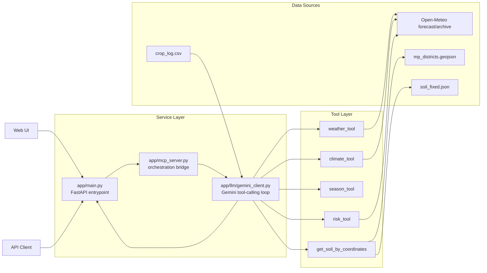
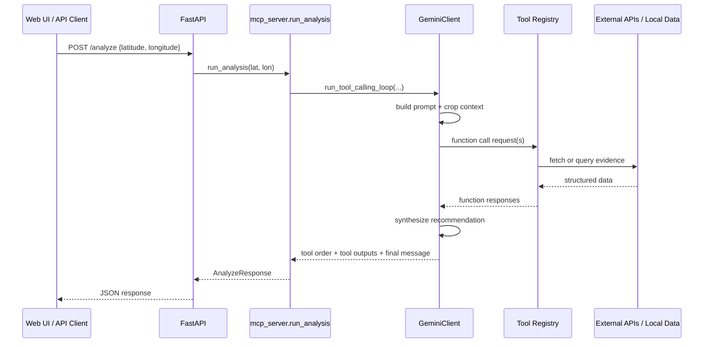
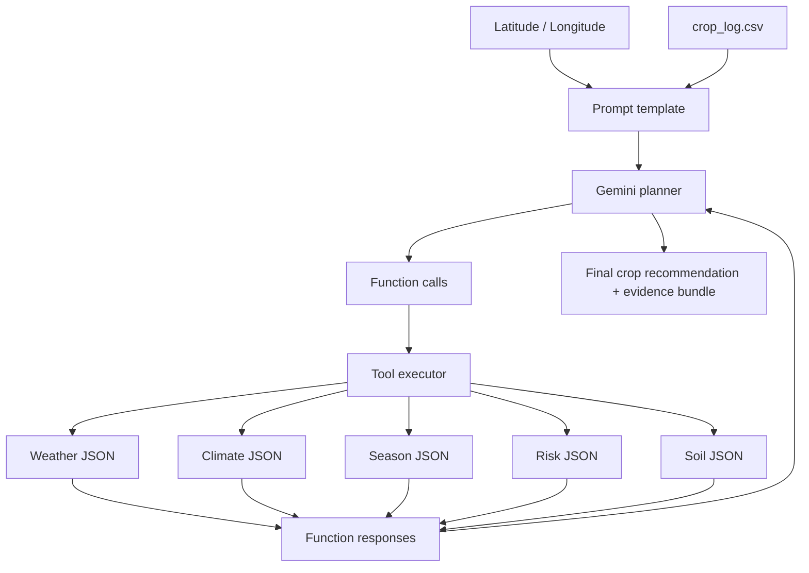
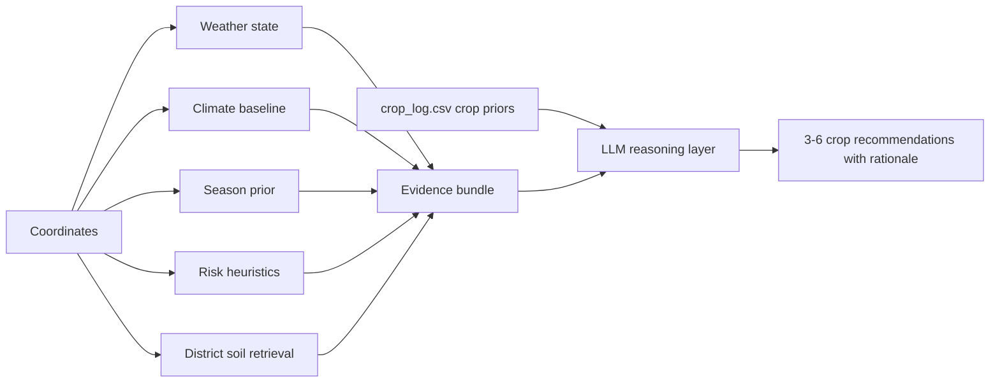
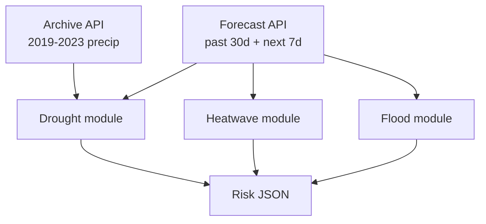
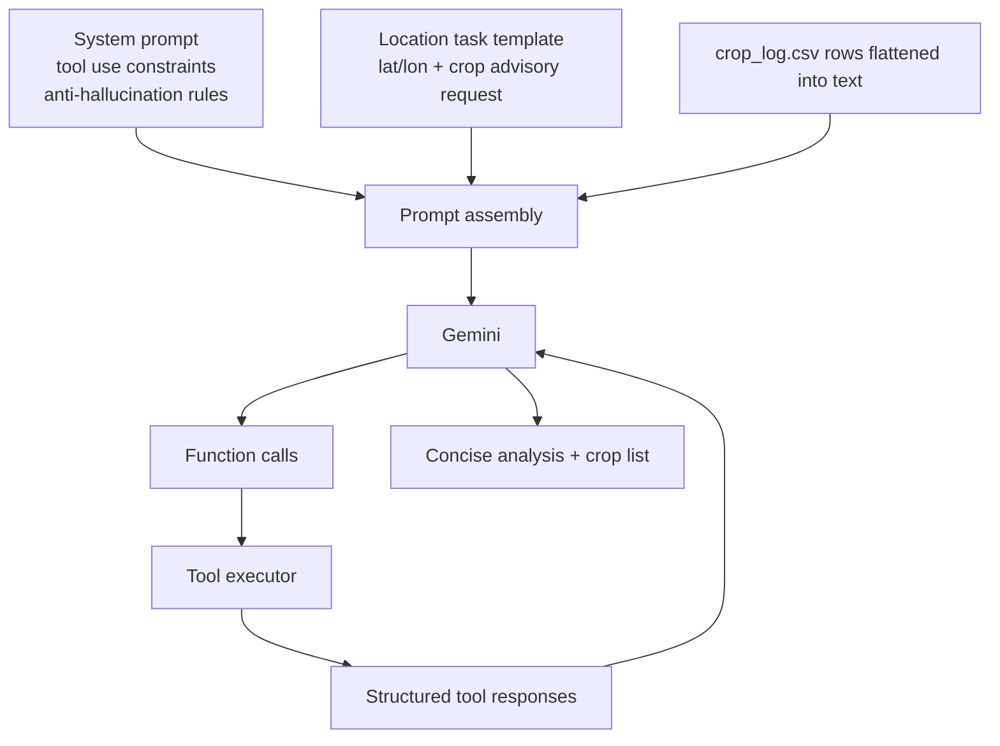

# MCP for Farmers

> AgroLLaMA System is a research-oriented agricultural intelligence stack that uses tool-grounded LLM orchestration, geospatial soil retrieval, and weather-risk synthesis to generate location-aware crop guidance for Madhya Pradesh.


```text
Field coordinates -> FastAPI API/UI -> Gemini tool planner -> Weather | Climate | Season | Risk | Soil tools -> Evidence bundle -> Crop recommendation
```



## Project Vision

Agronomic decision support is one of the clearest places where AI must be grounded in evidence instead of fluent approximation. Farmers do not need a generic chatbot; they need a system that can bind location, weather, climate history, soil constraints, seasonal timing, and operational risk into a transparent recommendation path.

This repository exists to prototype that stack. It combines a FastAPI service, a Gemini-based tool planner, and a set of deterministic environmental tools to answer a concrete question: given a field location, what crops are most defensible for current conditions in Madhya Pradesh?

The current implementation is strongest as a research baseline for:

- tool-grounded agricultural reasoning
- interpretable crop recommendation pipelines
- geospatial retrieval for district-level soil intelligence
- auditability through raw tool outputs plus final LLM synthesis
- rapid experimentation on field-level decision support interfaces

Real-world agricultural problems addressed by the current codebase include:

- field-level crop screening using weather, climate, soil, and risk evidence
- district-aware soil lookup from geospatial boundaries rather than free-text guessing
- season-aware crop recommendation for Kharif, Rabi, and Zaid contexts
- risk communication for drought, flood, and heat stress
- map-based location selection for non-technical users

## System Architecture

### Current MCP positioning

This repository implements an MCP-inspired orchestration pattern, not a standards-compliant MCP server transport today.

| Capability | Current repository | Notes |
| --- | --- | --- |
| Tool registry | Yes | Static Python registry in `app/tools/__init__.py` |
| Model-driven tool invocation | Yes | Gemini function calling controls execution order |
| Structured tool responses | Yes | Tool JSON is sent back as function responses |
| Standard MCP transport (stdio/SSE/server handshake) | No | Current interface is FastAPI HTTP |
| Tool discovery across clients | Partial | Declarations are model-local, not protocol-exposed |
| Multi-client MCP interoperability | No | Current implementation is application-specific |

### Request lifecycle

1. A client submits `latitude` and `longitude` to `POST /analyze`.
2. `app/main.py` validates the request with Pydantic and forwards it to `run_analysis`.
3. `app/mcp_server.py` instantiates `GeminiClient` and starts the tool-calling loop.
4. `GeminiClient` builds the prompt from location context plus `crop_log.csv`.
5. Gemini emits one or more function calls.
6. The backend executes only the requested tools via `execute_tool`.
7. Tool outputs are fed back to Gemini as structured function responses.
8. The loop ends when Gemini returns plain text instead of more function calls.
9. The API returns the final message plus `tool_execution_order` and `tools_output`.

### Sequence diagram



### Context and evidence flow



### Architectural interpretation

The repository implements a single-controller architecture:

- one LLM acts as planner and final explainer
- tools act as deterministic evidence providers
- no vector database, embedding index, or long-term memory is used
- no explicit multi-agent decomposition exists yet
- raw evidence is preserved in the response for downstream inspection

This design is attractive for research because it is auditable, simple to reproduce, and easy to benchmark. It is also limited because the planner is sequential, synchronous, and tightly coupled to one model provider.

## Repository Structure

### Runtime and research asset tree

```bash
.
|-- app/
|   |-- main.py                     # FastAPI entrypoint, routes, UI hosting
|   |-- mcp_server.py               # Bridge from HTTP request to LLM tool loop
|   |-- llm/
|   |   |-- gemini_client.py        # Gemini configuration, prompt construction, function-calling loop
|   |   `-- __init__.py
|   |-- schemas/
|   |   |-- models.py               # Pydantic request/response schemas
|   |   `-- __init__.py
|   |-- tools/
|   |   |-- __init__.py             # Tool registry and dispatcher
|   |   |-- weather_tool.py         # Open-Meteo forecast aggregation
|   |   |-- climate_tool.py         # Open-Meteo archive climate normals
|   |   |-- season_tool.py          # Month-to-season agricultural calendar
|   |   |-- risk_tool.py            # Drought/flood/heatwave heuristics
|   |   `-- soil_tool.py            # Point-in-polygon district soil lookup
|   `-- static/
|       |-- index.html              # Browser UI for map/manual coordinate input
|       |-- app.js                  # Frontend workflow and visualization logic
|       `-- styles.css              # UI presentation layer
|-- crop_log.csv                    # Crop prior table injected into the LLM prompt
|-- soil_fixed.json                 # District-level soil metadata
|-- mp_districts.geojson            # Madhya Pradesh district polygons for runtime lookup
|-- soil_data_process.ipynb         # Notebook for repairing and preparing soil/geospatial assets
|-- soil.json                       # Raw malformed soil dataset before repair
|-- gadm41_IND_shp/                 # Raw GADM India administrative shapefiles
|-- madhya_pradesh_administrative/  # Alternate MP shapefile source and attribution file
|-- convertcsv.csv                  # Research/preprocessing artifact
|-- district_data.xlsx              # Research/preprocessing artifact
|-- sesional data.xlsx              # Research/preprocessing artifact
|-- requirements.txt                # Python dependencies
`-- README.md
```

### Directory and asset roles

| Path | Role in system | Used at runtime |
| --- | --- | --- |
| `app/main.py` | API surface and UI host | Yes |
| `app/mcp_server.py` | Orchestration wrapper | Yes |
| `app/llm/gemini_client.py` | Prompting and Gemini function-calling | Yes |
| `app/tools/` | Environmental evidence providers | Yes |
| `app/static/` | Map UI and tool output renderer | Yes |
| `crop_log.csv` | Crop suitability prior table injected into prompt | Yes |
| `soil_fixed.json` | Soil metadata store | Yes |
| `mp_districts.geojson` | Geospatial lookup layer | Yes |
| `soil_data_process.ipynb` | Data preparation and reconciliation notebook | No |
| `soil.json` | Broken upstream/raw source repaired by notebook | No |
| `gadm41_IND_shp/` | Original India shapefiles | No |
| `madhya_pradesh_administrative/` | Alternate administrative shapefile source | No |
| `convertcsv.csv`, `district_data.xlsx`, `sesional data.xlsx` | Exploratory artifacts not imported by runtime code | No |

### Data provenance snapshot

| Asset | Size / count observed in repository | Provenance and role |
| --- | --- | --- |
| `crop_log.csv` | 20 crop rows | Runtime crop reference table appended to the LLM prompt |
| `soil_fixed.json` | 52 district records | District soil metadata with source URLs embedded per row |
| `mp_districts.geojson` | 51 district features | Runtime point-in-polygon boundary layer derived from GADM |
| `gadm41_IND_shp/` | GADM India levels 0-3 | Raw administrative boundary source used during preprocessing |
| `madhya_pradesh_administrative/` | MP shapefile + attribution text | Alternate boundary source from MapCruzin / OpenStreetMap derivative |

The flat root layout is functional for a prototype but not ideal for a publishable research repository. A cleaner next iteration would move these assets into `data/raw`, `data/processed`, `notebooks/`, and `artifacts/`.

## Tooling and Algorithms

### Tool matrix

| Tool | Purpose | Inputs | Data source(s) | Core algorithm | Output key | Complexity / runtime notes |
| --- | --- | --- | --- | --- | --- | --- |
| `weather_tool` | Near-term agronomic weather summary | `lat`, `lon` | Open-Meteo forecast | Aggregate current conditions plus 7-day forecast and 7-day past rainfall | `weather` | One network call; O(14) local aggregation; network-bound |
| `climate_tool` | Long-term background climate baseline | `lat`, `lon` | Open-Meteo archive | Compute 2014-2023 average temperature, rainfall, monthly normals, variability | `climate_normals` | One archive call; O(days in window); network-bound |
| `season_tool` | Current crop season prior | `lat`, `lon` | System clock | Rule-based mapping from month to Kharif/Rabi/Zaid | `season` | O(1) |
| `risk_tool` | Drought, flood, and heatwave estimates | `lat`, `lon` | Open-Meteo forecast + archive | SPI-like drought proxy, threshold-based heatwave detector, precipitation-driven flood heuristic | `risk_analysis` | Two network calls; O(archive days); network-bound |
| `get_soil_by_coordinates` | District soil grounding | `lat`, `lon` | `mp_districts.geojson`, `soil_fixed.json` | GeoPandas point-in-polygon plus district metadata lookup | `get_soil_by_coordinates` or soil dict without explicit `tool` field | Heavy cold start from GeoPandas load; per-query spatial scan over districts |

### Agricultural intelligence pipeline



### Risk computation graph



### Major module audit

<details>
<summary><code>app/main.py</code> - API entrypoint and UI host</summary>

**Purpose.** Exposes HTTP endpoints, serves the browser UI, mounts static assets, and delegates analysis requests into the orchestration layer.

**Inputs / Outputs.** Accepts `AnalyzeRequest` JSON at `/analyze` and `/api/analyze`; returns `AnalyzeResponse`. Also serves `/`, `/ui`, `/health`, and `/mp-geojson`.

**Internal workflow.**

1. Configure FastAPI and permissive CORS.
2. Mount `app/static`.
3. Serve `index.html` for UI routes.
4. Load `mp_districts.geojson` for the map UI.
5. Forward valid analysis requests to `run_analysis`.

**Algorithm / system behavior.** There is no heavy algorithm here; the file is an HTTP adapter around the orchestration core.

**Complexity / performance notes.** O(1) local control logic. The `/mp-geojson` route reads and parses the full GeoJSON file on every request instead of caching it.

**Weaknesses.** CORS is open to all origins, exceptions are returned to clients with raw messages, endpoints are synchronous, and there is no authentication, rate limiting, or response caching.

**Suggested improvements.** Cache the GeoJSON payload, move to async endpoints, introduce an error envelope, tighten CORS, and add auth plus rate limiting for public deployment.

**Research relevance.** It provides a reproducible API surface for benchmarking field-level agronomic reasoning workflows.
</details>

<details>
<summary><code>app/mcp_server.py</code> - orchestration bridge</summary>

**Purpose.** Converts a coordinate request into a model-mediated tool execution session and normalizes the result into the final response schema.

**Inputs / Outputs.** Inputs are `latitude`, `longitude`; output is `AnalyzeResponse`.

**Internal workflow.**

1. Instantiate `GeminiClient`.
2. Invoke `run_tool_calling_loop`.
3. Convert NumPy-like types to JSON-safe primitives.
4. Return structured location, tool order, tool outputs, and final text.

**Algorithm / system behavior.** This module is a wrapper; the only algorithmic logic is serialization safety.

**Complexity / performance notes.** O(number of tool rounds + response serialization). It creates a new Gemini client per request.

**Weaknesses.** No dependency injection, no shared model client, no timeout budget propagation, and duplicated JSON-conversion logic already present in `gemini_client.py`.

**Suggested improvements.** Promote JSON conversion into a shared utility module and manage the LLM client lifecycle centrally.

**Research relevance.** This file is the narrow waist between transport and reasoning, making it a natural intervention point for instrumentation and ablation studies.
</details>

<details>
<summary><code>app/llm/gemini_client.py</code> - prompt engineering and function-calling controller</summary>

**Purpose.** Encapsulates the LLM orchestration logic: prompt construction, tool declarations, function-call extraction, function-response reinjection, and final message synthesis.

**Inputs / Outputs.** Inputs are coordinates, a `tool_executor`, and `GEMINI_API_KEY`; output is a dict containing tool execution order, tool outputs, and final model text.

**Internal workflow.**

1. Load environment variables and configure Gemini.
2. Read `crop_log.csv` and flatten it into a compact prompt appendix.
3. Define tool declarations that mirror the Python registry.
4. Send a user prompt containing coordinates, tool constraints, and crop context.
5. Loop until Gemini stops emitting `function_call` parts.
6. Execute only model-requested tools and return their JSON payloads as function responses.

**Algorithm explanation.** The core algorithm is a bounded tool-calling loop with `max_rounds=15`. It behaves like a single-agent planner with explicit function dispatch and evidence reinjection.

**Complexity / performance notes.** Sequential and network-bound. Every request reloads the crop table, rebuilds the tool declaration list, and depends on the latency of each LLM round plus each tool call.

**Weaknesses.** The prompt hard-codes Madhya Pradesh even for out-of-region coordinates, the model is provider-specific and hard-coded to `gemini-2.0-flash`, there is no output schema enforcement for the final recommendation, and there is no retry, caching, deduplication, or tracing.

**Suggested improvements.** Cache prompt assets, externalize prompt templates, add structured recommendation schemas, allow pluggable models, and instrument each LLM round with latency and token accounting.

**Research relevance.** This is the most important experimental surface in the repository because it controls the balance between deterministic evidence and generative synthesis.
</details>

<details>
<summary><code>app/schemas/models.py</code> - request and response contracts</summary>

**Purpose.** Defines the Pydantic data contracts for the HTTP API and documents expected tool output shapes.

**Inputs / Outputs.** Validates incoming coordinates and outgoing response structure.

**Internal workflow.** Pure schema layer with field bounds for latitude and longitude.

**Algorithm / system behavior.** No algorithmic logic.

**Complexity / performance notes.** O(1) schema validation relative to request size.

**Weaknesses.** Tool output models are not enforced at runtime because tools return loose dicts. The final LLM message is unstructured free text.

**Suggested improvements.** Enforce typed tool responses, add versioned schemas, and introduce a structured recommendation schema with ranked crops and justification fields.

**Research relevance.** Well-defined schemas are essential for reproducible evaluation and downstream benchmarking.
</details>

<details>
<summary><code>app/tools/__init__.py</code> - static tool registry</summary>

**Purpose.** Maps model-visible tool names to Python callables and exposes a single dispatcher.

**Inputs / Outputs.** Inputs are a tool name and coordinates; output is the tool's JSON dict.

**Internal workflow.** Lookup in `TOOL_REGISTRY`, then execute the corresponding function.

**Algorithm / system behavior.** Constant-time registry dispatch.

**Complexity / performance notes.** O(1) lookup; runtime dominated by the selected tool.

**Weaknesses.** Tool metadata is split across this file and `gemini_client.py`, creating duplication and drift risk.

**Suggested improvements.** Define a unified `ToolSpec` abstraction that includes name, description, schema, callable, and observability hooks.

**Research relevance.** The registry is the foundation for any future migration to a standards-based MCP server.
</details>

<details>
<summary><code>app/tools/weather_tool.py</code> - short-horizon weather aggregation</summary>

**Purpose.** Produces a concise weather summary for decision support.

**Inputs / Outputs.** Inputs are coordinates; outputs include average temperature, min/max forecast temperature, rainfall, humidity, and precipitation probability.

**Internal workflow.**

1. Query Open-Meteo forecast with current weather, 7 future days, and 7 past days.
2. Split past and future segments from the returned daily arrays.
3. Aggregate forecast rainfall and past rainfall separately.
4. Derive a representative average temperature from current or forecast values.

**Algorithm explanation.** A simple time-window aggregation over forecast and recent-history meteorology.

**Complexity / performance notes.** One HTTP call; O(14) local processing. Almost entirely I/O-bound.

**Weaknesses.** Average temperature mixes current and forecast-derived values, the code comment about total rainfall is slightly inconsistent with the returned field, and there are no retries or cache layers.

**Suggested improvements.** Return explicit current, past, and future fields separately; add retries and TTL caching; share an HTTP client session.

**Research relevance.** Supplies the short-horizon environmental signal required for agronomic timing decisions.
</details>

<details>
<summary><code>app/tools/climate_tool.py</code> - long-term climate normals</summary>

**Purpose.** Provides a climatological baseline against which current conditions can be interpreted.

**Inputs / Outputs.** Inputs are coordinates; outputs include average rainfall per month, average temperature, monthly means, and variability statistics.

**Internal workflow.**

1. Query Open-Meteo archive for daily mean temperature and precipitation from 2014-2023.
2. Compute overall averages.
3. Group observations by month.
4. Estimate monthly rainfall and temperature normals plus standard deviations.

**Algorithm explanation.** A retrospective descriptive-statistics pipeline over a fixed 10-year time window.

**Complexity / performance notes.** One archive request and O(number of archived days) processing. Network latency dominates, followed by linear aggregation.

**Weaknesses.** The 10-year window is practical but not climatological standard, monthly precipitation is estimated from mean daily precipitation times 30.44 rather than true monthly totals, and no cache is used.

**Suggested improvements.** Use monthly archive endpoints or aggregate by actual month-year buckets, cache results by rounded coordinates, and optionally expand to 30-year normals where available.

**Research relevance.** Adds temporal context and supports the "weather anomaly versus baseline" reasoning pattern.
</details>

<details>
<summary><code>app/tools/season_tool.py</code> - seasonal crop calendar prior</summary>

**Purpose.** Encodes the current agricultural season as a simple prior.

**Inputs / Outputs.** Inputs are coordinates but they are not used; outputs are the current month and a season label.

**Internal workflow.** Read the system UTC month and map it to Kharif, Rabi, or Zaid.

**Algorithm explanation.** Rule-based calendar lookup.

**Complexity / performance notes.** O(1).

**Weaknesses.** Uses UTC instead of local agricultural time, assumes a uniform state-wide crop calendar, and ignores district-specific monsoon onset variability.

**Suggested improvements.** Use India Standard Time, parameterize by agro-climatic zone, and infer season from rainfall phase plus local crop calendars instead of month alone.

**Research relevance.** A simple but useful symbolic prior for crop planning.
</details>

<details>
<summary><code>app/tools/risk_tool.py</code> - heuristic drought, flood, and heatwave assessment</summary>

**Purpose.** Estimates operational weather risk for crop planning.

**Inputs / Outputs.** Inputs are coordinates; outputs are drought, flood, and heatwave probabilities plus supporting indicators.

**Internal workflow.**

1. Fetch 30 past days plus 7 forecast days from Open-Meteo forecast.
2. Fetch 2019-2023 archive precipitation for climatology.
3. Compute a drought z-score from actual 30-day rain versus same-calendar climatology.
4. Compute heatwave risk from forecast temperature thresholds.
5. Compute flood risk from 7-day precipitation totals, 1-day maxima, and antecedent wetness.

**Algorithm explanation.**

- Drought: SPI-like heuristic using z-score or ratio fallback.
- Heatwave: threshold and consecutive-day logic using 35 C, 38 C, and 40 C markers.
- Flood: rule-based probability accumulation from multi-day rainfall and intensity.

**Complexity / performance notes.** Two network calls plus O(archive days) aggregation. This is the heaviest non-LLM tool.

**Weaknesses.** The drought severity label logic is inconsistent because the "severe" branch is unreachable under the current conditional order, heatwave severity is not fully consecutive for the 38 C case, thresholds are not calibrated per district or soil type, and there is no uncertainty quantification.

**Suggested improvements.** Fix severity logic, calibrate thresholds against historical outcomes, return confidence intervals, and separate hazard scoring from presentation labels.

**Research relevance.** Provides an interpretable baseline for agro-risk estimation without requiring a trained hazard model.
</details>

<details>
<summary><code>app/tools/soil_tool.py</code> - geospatial soil grounding</summary>

**Purpose.** Resolves a coordinate to a Madhya Pradesh district and returns district-level soil evidence.

**Inputs / Outputs.** Inputs are coordinates; outputs are district, dominant soil, soil characteristics, or an error if the point is outside the spatial coverage.

**Internal workflow.**

1. Load and cache `mp_districts.geojson` with GeoPandas.
2. Load and cache `soil_fixed.json` into a district lookup.
3. Build a `Point(longitude, latitude)`.
4. Find the district polygon containing the point.
5. Join the district name to soil metadata and return structured output.

**Algorithm explanation.** Point-in-polygon geospatial retrieval over district polygons, followed by key-based metadata lookup.

**Complexity / performance notes.** Cold start is dominated by GeoPandas I/O and geometry construction. Warm-path lookup is roughly O(number of district polygons) because the runtime code does not use a spatial index even though the notebook demonstrates one.

**Weaknesses.** The return schema omits the declared `agricultural_suitability` field, the result does not include a consistent `tool` field, `contains()` excludes boundary points, and district alias mismatches remain between geometry and soil metadata.

**Suggested improvements.** Add district alias normalization, use `covers()` or buffered containment for boundary cases, build a spatial index at startup, and return the full declared schema consistently.

**Research relevance.** This is the repository's most distinctive retrieval component because it forces soil reasoning to be grounded in geospatial evidence instead of model prior.
</details>

<details>
<summary><code>app/static/index.html</code>, <code>app/static/app.js</code>, <code>app/static/styles.css</code> - field analyst interface</summary>

**Purpose.** Provides a lightweight browser interface for coordinate entry, map selection, tool output visualization, and final recommendation rendering.

**Inputs / Outputs.** Inputs are manual coordinates or map clicks; outputs are rendered tool cards, execution order, and markdown-formatted model recommendations.

**Internal workflow.**

1. Toggle between manual and map mode.
2. Fetch `/mp-geojson` to render the MP boundary.
3. Submit coordinates to `/analyze`.
4. Render execution order chips, tool-specific cards, and final LLM output.

**Algorithm explanation.** UI-side orchestration is event-driven and renderer-based; each tool has a dedicated presentation function.

**Complexity / performance notes.** Lightweight on the client side. Most latency comes from the backend request. The map asset adds an initial fetch cost.

**Weaknesses.** The LLM markdown is rendered through `marked` without explicit sanitization, external CDN dependencies are not pinned locally, and card rendering order can diverge from actual execution order for tools whose output keys differ from function names.

**Suggested improvements.** Sanitize rendered markdown, vendor critical frontend dependencies, and normalize tool names in the API response before client rendering.

**Research relevance.** The UI is useful for human-in-the-loop agronomy experiments and qualitative evaluation of explanation quality.
</details>

<details>
<summary><code>soil_data_process.ipynb</code> - preprocessing and reconciliation notebook</summary>

**Purpose.** Repairs malformed soil JSON, extracts Madhya Pradesh districts from GADM, normalizes district names, and tests point-in-polygon lookup logic.

**Inputs / Outputs.** Inputs are `soil.json` and `gadm41_IND_shp/gadm41_IND_2.shp`; outputs include `soil_fixed.json` and `mp_districts.geojson`.

**Internal workflow.**

1. Repair invalid JSON structure in the raw soil file.
2. Export MP district polygons to GeoJSON.
3. Compare district-name coverage across geometry and soil tables.
4. Prototype spatial indexing and soil lookup.

**Algorithm explanation.** A reproducible data curation workflow for research asset preparation.

**Complexity / performance notes.** Offline preprocessing cost only. Not part of the runtime critical path.

**Weaknesses.** Critical normalization logic identified in the notebook is not fully carried into the production runtime, leaving data mismatches unresolved in deployment.

**Suggested improvements.** Convert the notebook into versioned preprocessing scripts and add dataset validation tests in CI.

**Research relevance.** Makes the geospatial data pipeline inspectable and reproducible, which is important for academic use.
</details>

## AI and ML Architecture

### What the current system actually uses

| Component | Present | Notes |
| --- | --- | --- |
| Tool-augmented LLM reasoning | Yes | Gemini function calling drives tool selection |
| Prompt engineering | Yes | System prompt + user prompt + CSV crop context |
| Long-term memory | No | No persisted conversation or user memory |
| Vector database / embeddings | No | Retrieval is geospatial and table-based, not semantic |
| Fine-tuning | No | All reasoning uses an off-the-shelf Gemini model |
| Multimodal inputs | Partial | Map UI selects coordinates, but the API itself is text/JSON only |
| Multi-agent architecture | No | A single controller model orchestrates all tools |

### Prompt and reasoning stack



### Context engineering logic

| Layer | Function | Strength | Limitation |
| --- | --- | --- | --- |
| System prompt | Enforces tool use and anti-hallucination rules | Strong control over soil grounding | Model-specific prompt discipline rather than hard guarantees |
| User prompt template | Defines the location analysis task | Clear objective and formatting intent | Hard-codes Madhya Pradesh framing |
| Crop table injection | Adds crop priors without another database | Transparent and easy to inspect | Re-read every request; not normalized as structured retrieval |
| Function responses | Returns machine-generated evidence to the model | Keeps recommendations grounded | No ranking or confidence schema enforced in final text |

### Decision pipeline interpretation

The current decision system is best described as a hybrid evidence-plus-synthesis pipeline:

1. Deterministic environmental tools collect evidence.
2. A single LLM agent decides which evidence to request.
3. The LLM then synthesizes a crop shortlist and justification narrative.

This is not yet a learned crop-ranking model. There is no supervised crop suitability classifier, no retrieval-augmented semantic search, and no explicit optimization over profit, yield, or water constraints. That makes the system easier to audit, but weaker as a calibrated decision engine.

## Research Contributions

The repository is most credible as a research baseline in the following ways:

1. It demonstrates tool-grounded agronomic reasoning rather than free-form crop advice.
2. It couples weather, climate normals, heuristic risk, and geospatial soil retrieval in a single transparent pipeline.
3. It exposes the exact tool execution trace through `tool_execution_order`, which is valuable for interpretability and failure analysis.
4. It injects crop priors from a structured tabular source, reducing unconstrained agricultural hallucination.
5. It includes the preprocessing artifacts needed to understand how local soil intelligence was constructed.

From an academic perspective, the most publishable angle is not algorithmic novelty alone, but the explicit combination of:

- grounded tool use
- district-level geospatial retrieval
- auditable evidence bundles
- crop recommendation explanation under environmental uncertainty

## Technical Audit Findings

### High-value findings from the code audit

| Finding | Severity | Impact | Evidence |
| --- | --- | --- | --- |
| The repository is MCP-inspired, not yet a standards-compliant MCP server | Medium | Limits interoperability with general MCP clients | `app/mcp_server.py`, `app/llm/gemini_client.py` |
| Soil runtime output does not match the declared schema | High | Missing `agricultural_suitability` weakens crop grounding | `app/tools/soil_tool.py` |
| District alias mismatches remain between geometry and soil metadata | High | Some valid MP locations may fail to return soil metadata | `soil_data_process.ipynb`, `app/tools/soil_tool.py` |
| Drought severity branching is logically inconsistent | High | Risk labels can be wrong even when probabilities are computed | `app/tools/risk_tool.py` |
| Markdown rendering is not explicitly sanitized | High | Exposes an avoidable XSS surface in the UI | `app/static/app.js` |
| Blocking I/O is used throughout the stack | Medium | Throughput is limited under concurrent load | `app/main.py`, all runtime tools |
| Prompt and tool metadata are duplicated across layers | Medium | Raises drift risk and increases maintenance cost | `app/llm/gemini_client.py`, `app/tools/__init__.py`, `app/static/app.js` |
| Research artifacts and cache files are mixed into the root repository | Low | Reduces repository hygiene and reproducibility | root layout, `__pycache__`, flat data files |

### Dead code, drift, and duplication

| Category | Observation | Recommended action |
| --- | --- | --- |
| Exploratory assets | `convertcsv.csv`, `district_data.xlsx`, and `sesional data.xlsx` are not imported by runtime code | Move into `data/raw` or `research/` and document their provenance |
| Raw soil source | `soil.json` is malformed and only used in the notebook | Keep as raw source or archive it outside the runtime root |
| JSON/native conversion | Serialization helpers exist in both `mcp_server.py` and `gemini_client.py` | Consolidate into `app/utils/serialization.py` |
| Open-Meteo access | Request logic is repeated across weather, climate, and risk tools | Introduce a shared `OpenMeteoClient` |
| Tool naming normalization | Backend, Gemini declarations, and frontend renderer aliases are maintained separately | Define a single tool metadata registry shared across layers |

### Recommended refactor trajectory

1. Split the repository into `src/`, `data/raw/`, `data/processed/`, `notebooks/`, and `docs/`.
2. Introduce a shared tool specification abstraction with schemas and runtime metadata.
3. Move preprocessing logic out of the notebook and into scripted, testable data pipelines.
4. Replace blocking requests with async clients and add caching for weather/climate/risk retrieval.
5. Add a true MCP server transport layer for standard interoperability.

## Performance and Scalability

### Expected performance profile from static code analysis

| Stage | External operations | Dominant cost | Scalability note |
| --- | --- | --- | --- |
| API request parsing | None | Negligible CPU | Scales well |
| Gemini planning round | 1 LLM call per round | Network latency + provider response time | Sequential rounds lengthen critical path |
| `weather_tool` | 1 forecast request | External I/O | Good candidate for response caching |
| `climate_tool` | 1 archive request | External I/O + linear aggregation | Cache strongly because normals are stable |
| `risk_tool` | 2 Open-Meteo requests | External I/O + archive aggregation | Heaviest tool on the hot path |
| `soil_tool` cold start | GeoPandas file load | Disk I/O + geometry construction | Warm at process level after first call |
| `soil_tool` warm query | Local spatial scan | Geometry containment | Acceptable at district scale, weak for larger geographies |
| Final synthesis | 1 LLM call | Network latency | Adds unavoidable tail latency |

### Throughput interpretation

The current `/analyze` path is fundamentally sequential:

- one request creates one Gemini client
- the model decides tool order
- tools are executed synchronously
- tool responses are reinjected before the next model step

This means throughput is bounded by external I/O more than CPU. On a single worker, concurrency will degrade quickly when many requests wait on LLM and weather/archive APIs.

### Bottlenecks


### Scalability improvements

- replace `requests` with `httpx.AsyncClient`
- cache climate normals by rounded coordinates for days or weeks
- cache weather and risk results by rounded coordinates with short TTLs
- build the soil spatial index at startup and reuse prepared geometries
- reuse one model client per worker instead of per request
- instrument tool durations and model round counts
- support parallel execution when the model emits multiple function calls in one turn

## Security and Reliability

| Area | Current state | Risk | Recommended hardening |
| --- | --- | --- | --- |
| API auth | None | Public misuse, quota drain | Add API keys or OAuth for non-local deployment |
| CORS | `allow_origins=["*"]` | Overly permissive browser access | Restrict to trusted origins |
| Secrets | `.env` with `GEMINI_API_KEY` | Local only, adequate for prototype | Move to secret manager in deployment |
| Prompt safety | Strong soil grounding instructions | Still prompt-based, not policy-enforced | Add output validation and recommendation schema checks |
| Markdown rendering | Unsanitized `marked` rendering | Potential XSS | Sanitize or render a safe markdown subset |
| External dependencies | Open-Meteo, Gemini, CDNs | Upstream failures impact service | Add retries, timeouts, fallbacks, local asset hosting |
| Error handling | Tools often return structured errors | Better than crashing, but inconsistent | Standardize error envelopes and retry strategy |
| Observability | Logging only | Weak production diagnosis | Add tracing, metrics, request IDs, and tool-level latency logs |
| Testing | No automated tests in repo | Regression risk | Add unit, integration, and data-validation tests |

### Reliability notes

The current prototype already includes a few sound choices:

- tool failures are usually converted into structured payloads instead of hard crashes
- soil hallucination is explicitly prohibited at the prompt level
- raw tool outputs are returned to the caller for independent inspection

However, true production reliability would require:

- retries with backoff
- circuit breakers for external APIs
- deterministic fallbacks when the LLM provider is unavailable
- startup checks for geospatial assets and credentials
- CI validation for data coverage and schema consistency

## Installation

### Prerequisites

- Python 3.10 or newer
- A Gemini API key in `GEMINI_API_KEY`
- System support for `geopandas` and its compiled geospatial dependencies

### Local environment

```bash
python -m venv .venv
```

Windows PowerShell:

```powershell
.\.venv\Scripts\Activate.ps1
```

macOS / Linux:

```bash
source .venv/bin/activate
```

Install dependencies:

```bash
pip install -r requirements.txt
```

Set environment variables:

```env
GEMINI_API_KEY=your_gemini_api_key_here
```

Run the server:

```bash
uvicorn app.main:app --reload
```

Open:

- UI: `http://127.0.0.1:8000/`
- API docs: `http://127.0.0.1:8000/docs`
- Health check: `http://127.0.0.1:8000/health`

### Notes on geospatial dependencies

If `geopandas` installation fails on Windows, use prebuilt wheels or a Conda environment. The runtime soil pipeline depends on GeoPandas and Shapely for point-in-polygon lookup.

### Reference Docker setup

The repository does not currently ship with a `Dockerfile`, but the following reference containerization pattern matches the present codebase:

```dockerfile
FROM python:3.11-slim

WORKDIR /app

RUN apt-get update && apt-get install -y --no-install-recommends \
    gdal-bin libgdal-dev build-essential \
    && rm -rf /var/lib/apt/lists/*

COPY requirements.txt .
RUN pip install --no-cache-dir -r requirements.txt

COPY . .

ENV PYTHONUNBUFFERED=1
EXPOSE 8000

CMD ["uvicorn", "app.main:app", "--host", "0.0.0.0", "--port", "8000"]
```

### Deployment guidance

- For internal demos: deploy behind a reverse proxy with restricted CORS.
- For research environments: add structured logging, pinned data assets, and dataset version tags.
- For production pilots: separate preprocessing assets from runtime images and add an auth layer plus API quotas.

## Usage Examples

### Programmatic API call

```bash
curl -X POST http://127.0.0.1:8000/analyze \
  -H "Content-Type: application/json" \
  -d '{"latitude": 23.2599, "longitude": 77.4126}'
```

PowerShell:

```powershell
Invoke-RestMethod -Uri "http://127.0.0.1:8000/analyze" `
  -Method POST `
  -ContentType "application/json" `
  -Body '{"latitude": 23.2599, "longitude": 77.4126}'
```

### Example response shape

```json
{
  "location": {
    "latitude": 23.2599,
    "longitude": 77.4126
  },
  "tool_execution_order": [
    "weather_tool",
    "climate_tool",
    "season_tool",
    "risk_tool",
    "get_soil_by_coordinates"
  ],
  "tools_output": {
    "weather": {
      "tool": "weather",
      "avg_temp_c": 28.4,
      "min_temp_c": 22.1,
      "max_temp_c": 34.5,
      "total_rainfall_mm": 31.8
    },
    "climate_normals": {
      "tool": "climate_normals",
      "avg_rainfall_normal_mm": 92.7,
      "avg_temp_normal_c": 25.4
    },
    "season": {
      "tool": "season",
      "current_month": 5,
      "current_season": "Zaid"
    },
    "risk_analysis": {
      "tool": "risk_analysis",
      "drought_probability": 0.22,
      "flood_probability": 0.08,
      "heatwave_probability": 0.35
    },
    "get_soil_by_coordinates": {
      "district": "Bhopal",
      "dominant_soil": "Black cotton soil",
      "soil_characteristics": "High moisture retention"
    }
  },
  "llm_final_message": "Concise crop recommendation with reasoning."
}
```

### Realistic farmer-intent workflows

The current public API accepts coordinates, not arbitrary user questions. The table below maps natural-language farming intent to the repository's current invocation model.

| Farmer intent | Coordinates | Expected evidence path | Typical output |
| --- | --- | --- | --- |
| "Which Kharif crops are defensible near Bhopal?" | Bhopal-area coordinates | Weather + climate + season + risk + soil | Shortlist of crops with weather/soil reasoning |
| "Is this field too heat-stressed for the next sowing window?" | Any MP field point | Weather + risk + season | Heatwave and rainfall-aware crop caution |
| "What soil type do I have in this district?" | MP coordinate | Soil tool only or soil-first reasoning | District, dominant soil, characteristics |
| "I am outside MP; can the system still help?" | Out-of-state coordinates | Weather + climate + season + risk; soil returns error | Partial analysis with explicit soil limitation |

### Frontend workflow

1. Open the root page.
2. Choose manual coordinates or map mode.
3. Submit a field location.
4. Inspect tool execution order, raw evidence cards, and the final recommendation.

## Future Work

### Research and engineering roadmap

- implement a standards-compliant MCP server transport and tool discovery layer
- add user-authored natural-language queries instead of fixed location-only prompting
- promote soil retrieval to a richer agronomic knowledge layer with nutrient and pH data
- integrate satellite imagery, remote sensing indices, and IoT sensor feeds
- replace heuristic risk rules with calibrated district-level hazard models
- add multilingual and voice-first interfaces for Hindi and regional dialects
- support offline-first and edge deployment for low-connectivity farming environments
- introduce deterministic crop ranking, confidence estimates, and counterfactual comparisons
- add full observability, CI, regression tests, and data versioning
- package the repository with a license, citation metadata, and reproducible benchmark scripts

### Recommended target architecture


## Summary

This repository already contains the core ingredients of a serious agricultural AI research prototype:

- explicit tool-grounded reasoning
- local geospatial soil retrieval
- interpretable evidence return paths
- a usable field-analysis UI

Its main gap is not ambition but systems maturity. The path to a research-grade open-source project is clear: standardize the protocol layer, harden the runtime, formalize the data pipeline, and turn the current heuristics into benchmarked, validated agronomic intelligence components.
